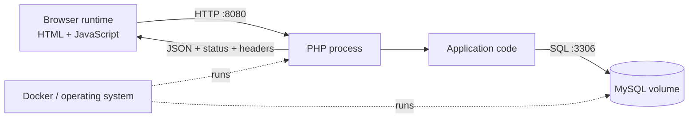

# 1. What Full-Stack Development Actually Means

[Book home](../../README.md) · [Next: Follow a request](02-follow-a-request.md)

A stack is a set of cooperating runtimes and boundaries, not a job-title checklist. RelayDesk Part I has six observable pieces.



## Observe the map

Start the system from the repository root:

```sh
make setup
make up
docker compose ps
curl -i http://localhost:8080/api/tickets
```

Open <http://localhost:8080>. Compare the page, the JSON body from `curl`, and `docker compose ps`. The browser renders the frontend; port 8080 is a network boundary; the PHP process runs application code; MySQL stores rows; Docker supplies the runtime environment. None of these labels says where a defect is.

For each observation, ask **Which layer owns this behavior?** A red console exception is browser evidence. A `503` JSON response is server evidence about an unavailable dependency. A missing row found with SQL is persistence evidence. Evidence can cross a boundary without being owned there.

## Evidence exercise

1. Add a ticket in the page.
2. Run `docker compose logs --tail=10 web` and find a `request.complete` event.
3. Run `docker compose exec db mysql -urelaydesk -prelaydesk relaydesk -e 'SELECT id, subject FROM tickets;'`.
4. Annotate which boundary produced each observation.

**Reasoning check:** if the database row exists but no list item appears, which layers remain suspects? Do not choose between them until Network, Console, and DOM evidence discriminate.

Run `scripts/lab chapter 1 verify`. It creates and retrieves a record, proving the whole map rather than merely checking that containers exist.

## Debugging method

Every controlled failure uses: **Symptom → Evidence → Boundary → Hypothesis → Investigation → Root Cause → Fix → Verification**. Record facts before explanations. At each step ask: *is the value wrong, missing, or is a component unavailable?*
