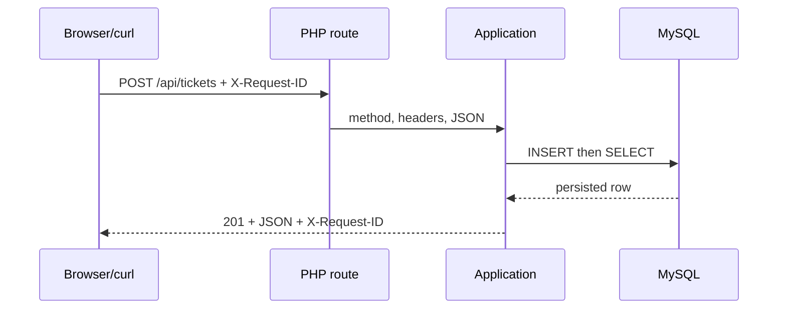

# 2. Follow a Request Through the Stack

[Previous](01-full-stack-means-boundaries.md) · [Next](03-browser-runtime.md)

One identifier lets us prove that browser, HTTP response, and server log observations describe the same request.



## Trace one request

In one terminal follow logs: `docker compose logs -f web`. In another run:

```sh
curl -i -H 'X-Request-ID: chapter2-demo' \
  -H 'Content-Type: application/json' \
  -d '{"subject":"Trace the printer request"}' \
  http://localhost:8080/api/tickets
docker compose exec db mysql -urelaydesk -prelaydesk relaydesk \
  -e "SELECT id, subject, created_at FROM tickets ORDER BY id DESC LIMIT 1;"
```

Evidence should include status `201`, response header `X-Request-ID: chapter2-demo`, a JSON row, a log event with the same ID, and the stored row. The database row has no request ID in this deliberately tiny schema; its ID/subject and ordering support the persistence observation, while the echoed correlation ID directly joins HTTP and log evidence. State that limitation rather than overstating proof.

## Controlled failure: response shape

```sh
curl -sS -H 'X-Request-ID: chapter2-broken' \
  -H 'X-Lab-Fault: response-field' http://localhost:8080/api/tickets
```

The response contains `title` where the browser expects `subject`. The database remains correct. In DevTools Network the request succeeds with `200`, while rendered items show `undefined`. Evidence places the wrong value at the application/response contract boundary—not at the connection boundary or in storage.

Remove the fault header (the normal browser never sends it), reload, and run `scripts/lab chapter 2 verify`. That is the fix and verification. Lab controls are explicit, local-only, and never silently alter normal behavior.
