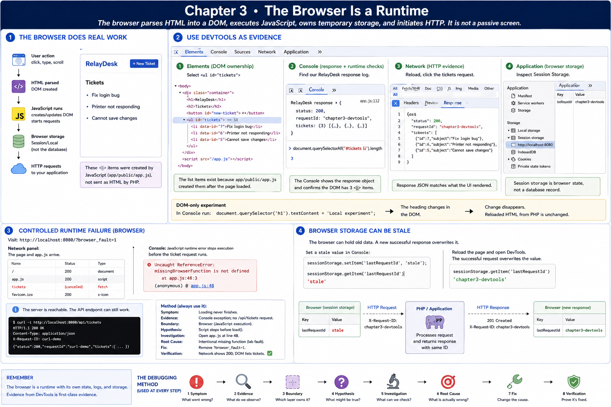

# 3. The Browser Is a Runtime

[Previous](02-follow-a-request.md) · [Next](04-http.md)



The browser parses HTML into a DOM, executes JavaScript, owns temporary storage, and initiates HTTP. It is not a passive screen.

## Use DevTools as evidence

Open <http://localhost:8080>, then DevTools:

1. **Elements:** select `<ul id="tickets">`; list items were created by `app/public/app.js`, not sent as HTML by PHP.
2. **Console:** find `RelayDesk response` with status and request ID. Run `document.querySelectorAll('#tickets li').length`.
3. **Network:** reload, select `tickets`, and compare Response with rendered list.
4. **Application/Storage:** inspect Session Storage and `lastRequestId`. Session storage is browser state, not a database record.
5. In Console run `document.querySelector('h1').textContent = 'Local experiment'`. Reload: the DOM-only change disappears.

## Controlled runtime failure

Visit <http://localhost:8080/?browser_fault=1>. Network shows `/` and `/app.js` arrived, but Console reports `ReferenceError: missingBrowserFunction is not defined`; the ticket request never runs. The server is reachable and its application endpoint may still pass:

```sh
curl -i http://localhost:8080/api/tickets
```

Use the method: symptom (loading never finishes), evidence (console exception and absent API request), boundary (browser execution), hypothesis (script stops before `load()`), investigation (open the linked source line), root cause (intentional missing function), fix (remove `?browser_fault=1`), verification (Network gets `200`, DOM lists tickets).

Try `sessionStorage.setItem('lastRequestId', 'stale')` and reload. A successful request overwrites it. This shows why browser storage can be stale and why the response header is stronger current-request evidence.
