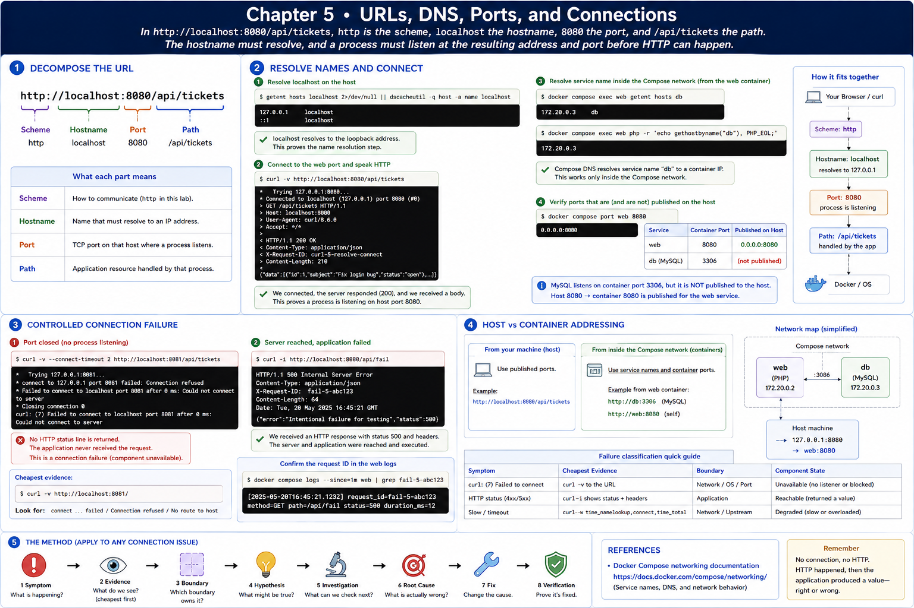

# 5. URLs, DNS, Ports, and Connections

[Previous](04-http.md) · [Next](06-server-process.md)



In `http://localhost:8080/api/tickets`, `http` is the scheme, `localhost` the hostname, `8080` the port, and `/api/tickets` the path. The hostname must resolve, and a process must listen at the resulting address and port before HTTP can happen.

## Resolve and connect

```sh
getent hosts localhost 2>/dev/null || dscacheutil -q host -a name localhost
curl -v http://localhost:8080/api/tickets
docker compose exec web getent hosts db
docker compose exec web php -r 'echo gethostbyname("db"), PHP_EOL;'
```

`localhost` resolves on the host; Compose DNS resolves service name `db` inside the Compose network. MySQL listens at container port 3306, but it is intentionally not published to the host. The web port is published as host 8080 → container 8080.

## Controlled connection failure

```sh
curl -v --connect-timeout 2 http://localhost:8081/api/tickets
curl -i http://localhost:8080/api/fail
```

Port 8081 normally produces `curl: (7)` and no HTTP status: no connection, so the application cannot have received it. `/api/fail` returns HTTP `500`, response headers, and a request ID: the server was reached and application code failed. Confirm the latter ID in `docker compose logs web`.

If 8081 is in use on your machine, choose a closed high port. Record symptom, cheapest evidence (`curl -v`), boundary, and whether the component is unavailable or returned a wrong value. See the [Docker Compose networking documentation](https://docs.docker.com/compose/how-tos/networking/) for service-name behavior.
