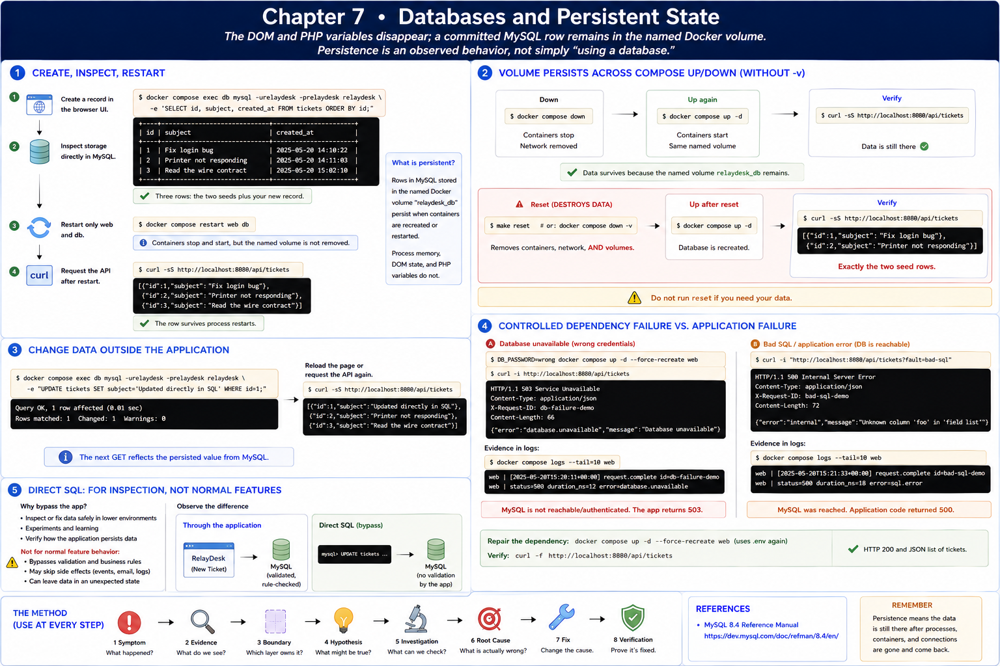

# 7. Databases and Persistent State

[Previous](06-server-process.md) · [Next](08-build-the-smallest-full-stack.md)



The DOM and PHP variables disappear; a committed MySQL row remains in the named Docker volume. Persistence is an observed behavior, not simply “using a database.”

## Create, inspect, restart

Create a record in the browser, then inspect storage directly:

```sh
docker compose exec db mysql -urelaydesk -prelaydesk relaydesk \
  -e 'SELECT id, subject, created_at FROM tickets ORDER BY id;'
docker compose restart web db
curl -sS http://localhost:8080/api/tickets
```

The row survives both process restarts. Run `docker compose down`, then `docker compose up -d`; it survives because the named volume survives. In contrast, `make reset` runs `docker compose down -v`, deletes it, and recreates exactly the two seed rows. Do not reset if you need your data.

Change a value outside the application and reload:

```sh
docker compose exec db mysql -urelaydesk -prelaydesk relaydesk \
  -e "UPDATE tickets SET subject='Updated directly in SQL' WHERE id=1;"
```

The browser reflects the persisted value on its next GET.

## Controlled dependency failure

Run `DB_PASSWORD=wrong docker compose up -d --force-recreate web`, then request the API. Expect HTTP `503` and a request ID; logs contain `database.unavailable`. This differs from a bad SQL column, which reaches MySQL and returns `500` from application handling. Repair with `docker compose up -d --force-recreate web` so Compose again uses `.env`, then verify `curl -f http://localhost:8080/api/tickets`.

Direct SQL bypasses application validation and is for inspection/experiments, not normal feature behavior. MySQL behavior is documented in the [MySQL 8.4 Reference Manual](https://dev.mysql.com/doc/refman/8.4/en/).
