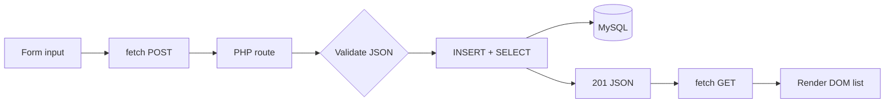

# 8. Build the Smallest Full Stack

[Previous](07-persistent-state.md) · [Next: A real Laravel application](09-real-laravel-application.md)

The milestone is one genuine vertical feature: browser input → HTTP request → PHP validation and SQL → MySQL row → JSON response → refreshed GET → DOM.



## Complete and trace the feature

1. Run `make reset`, wait for services, and open <http://localhost:8080> with DevTools Network and Console visible.
2. Enter `Chapter 8 vertical ticket` and submit.
3. Inspect POST method, JSON request body, `201`, `Location`, response JSON, and `X-Request-ID`.
4. Observe the following GET and changed DOM.
5. Find both request IDs in `docker compose logs web`.
6. Query `SELECT id, subject FROM tickets ORDER BY id DESC LIMIT 1` with the Chapter 7 database command.

Each observation is evidence at a different boundary. The POST ID joins browser response and server log. The returned row ID/subject joins response and persistence. The subsequent GET body joins persistence and render input.

## Break, diagnose, repair

```sh
curl -i -H 'X-Request-ID: chapter8-broken' \
  -H 'X-Lab-Fault: column-mismatch' http://localhost:8080/api/tickets
docker compose logs web | grep chapter8-broken
docker compose exec db mysql -urelaydesk -prelaydesk relaydesk -e 'DESCRIBE tickets;'
```

**Symptom:** HTTP 500. **Evidence:** a response and matching log exist; `DESCRIBE` shows `subject`, while the fault makes the query request `title`. **Boundary:** application-to-database query. **Hypothesis/investigation:** column contract mismatch, tested by schema inspection. **Root cause:** deterministic local fault substitutes the wrong column. **Fix:** remove `X-Lab-Fault`. **Verification:**

```sh
curl -f http://localhost:8080/api/tickets
make smoke
make test
```

The automated behavior test also activates the mismatch and asserts a controlled `500`, while normal paths must remain green. Part I is complete when you can explain every arrow, distinguish no listener from HTTP/application/database failures, preserve or reset state intentionally, and support each claim with evidence.

## What comes next

Chapter 9 should replace—not wrap—this disposable PHP slice with a minimal Laravel backend, compare its request lifecycle to this implementation, keep MySQL and the observable ticket contract, and add framework-native feature tests. React, authentication, Redis, queues, and production deployment remain later work.
