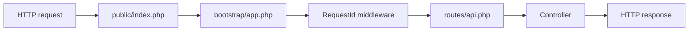

# 9. A Real Laravel Application

[Previous](08-build-the-smallest-full-stack.md) · [Next](10-routes-and-controllers.md)

Chapter 8 exposed one router file. Laravel now performs the same necessary work through named components: `public/index.php` receives the request, Composer loads classes, `bootstrap/app.php` builds the application/container, middleware decorates the request, the router dispatches it, and a response returns. The framework removes repetition, not causality.



## Run and trace

```sh
make setup && make up
curl -i -H 'X-Request-ID: chapter9-trace' http://localhost:8080/api/tickets
docker compose logs web | grep chapter9-trace
docker compose exec web php artisan route:list
docker compose exec web php artisan about
```

The entry point turns globals into an `Illuminate\Http\Request`. The router selects a controller. Laravel's container constructs that controller and later injects services by their type. `RequestId` proves middleware ran by putting the same safe ID in request attributes, log context, and the response.

## Controlled configuration failure: stale cache

Configuration is environment input interpreted by PHP. Run:

```sh
docker compose exec web php artisan config:cache
docker compose exec web sh -c 'APP_NAME=Wrong php artisan about | grep Environment'
docker compose exec web php artisan config:clear
```

A cached configuration does not reread changed environment values. **Symptom → Evidence → Boundary:** surprising configuration → `config:show app` and cached file existence → framework configuration bootstrap. Do not debug routing or MySQL. Clear the cache for local work, then verify `php artisan config:show app`. Production can deliberately build a cache only after final environment semantics are understood.

The old browser remains deliberately small, but its POST now enters Laravel and the domain schema. Laravel documentation calls this the [request lifecycle](https://laravel.com/docs/12.x/lifecycle); inspect our files before treating the diagram as an answer.
