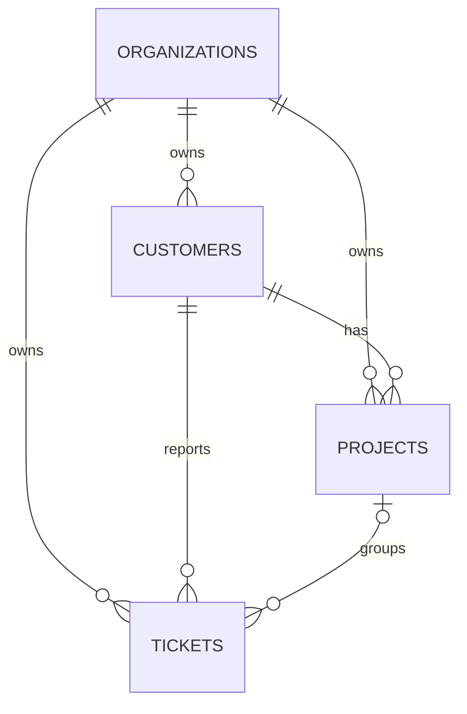

# 12. Migrations and Schema Evolution

[Previous](11-models-and-domain-objects.md) · [Next](13-crud-observable.md)

A migration is an ordered, reviewable state transition. RelayDesk introduces only four current entities. Organizations own customers, projects, and tickets. Foreign keys express required parents; `project_id` is nullable because a general support ticket need not belong to a project. Defaults make new tickets `open`, `normal`, version 1. Timestamps make mutations inspectable.



```sh
docker compose exec web php artisan migrate:status
docker compose exec db mysql -urelaydesk -prelaydesk relaydesk -e 'SHOW CREATE TABLE tickets\G'
docker compose exec db mysql -urelaydesk -prelaydesk relaydesk -e 'SELECT * FROM migrations ORDER BY batch,migration;'
```

## Controlled schema failure

```sh
docker compose exec db mysql -urelaydesk -prelaydesk relaydesk \
 -e "INSERT INTO tickets (organization_id,customer_id,subject) VALUES (1,999999,'Broken parent');"
```

Expect a foreign-key error and no row. The request boundary was bypassed; database evidence owns the rejection. Inspect `SHOW CREATE TABLE`, not merely model code.

`make reset` destroys the volume, migrates from zero, and seeds the same small scenario. `php artisan migrate:fresh --seed` is the in-container shortcut. Persistent changes demand rollout, existing-row, rollback, and compatibility thinking: ordinary PHP disappears on redeploy, while stored rows outlive processes and may be read by two application versions during deployment.
