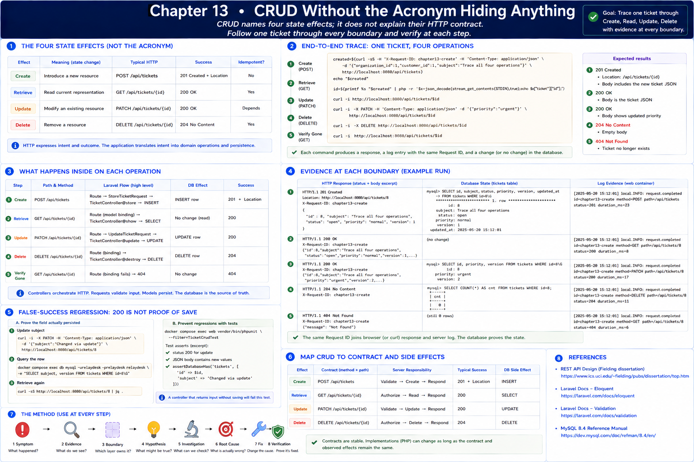

# 13. CRUD Without the Acronym Hiding Anything

[Previous](12-migrations-and-schema-design.md) · [Next](14-relationships.md)



CRUD names four state effects; it does not explain their HTTP contract. Follow one ticket through every boundary.

```sh
created=$(curl -sS -H 'X-Request-ID: chapter13-create' -H 'Content-Type: application/json' \
 -d '{"organization_id":1,"customer_id":1,"subject":"Trace all four operations"}' http://localhost:8080/api/tickets)
echo "$created"
id=$(printf %s "$created" | php -r '$x=json_decode(stream_get_contents(STDIN),true);echo $x["ticket"]["id"];')
curl -i http://localhost:8080/api/tickets/$id
curl -i -X PATCH -H 'Content-Type: application/json' -d '{"priority":"urgent"}' http://localhost:8080/api/tickets/$id
curl -i -X DELETE http://localhost:8080/api/tickets/$id
curl -i http://localhost:8080/api/tickets/$id
docker compose logs web | grep chapter13-create
```

Create is `POST → route → StoreTicketRequest → controller → INSERT → 201 + Location`. Retrieve is `GET → binding/SELECT → 200`. Update is `PATCH → validation → UPDATE → 200`. Delete is `DELETE → DELETE → 204`; later retrieval is `404`. Inspect the row between commands to connect responses to persistent state.

## False-success regression

An update returning `200` is not proof that the intended field persisted. Change a subject, query the row, and retrieve it again. The feature test asserts both JSON and `assertDatabaseHas`, preventing a controller that returns input without saving from looking successful:

```sh
docker compose exec web vendor/bin/phpunit --filter=TicketCrudTest
```

HTTP status, response body, SQL state, logs, and tests are complementary evidence. Generators can type boilerplate but cannot choose these contracts.
