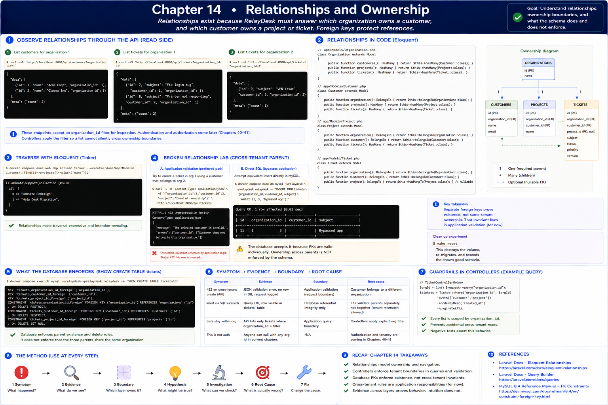

# 14. Relationships and Ownership

[Previous](13-crud-observable.md) · [Next](15-validation.md)



Relationships exist because RelayDesk must answer which organization owns a customer and which customer owns a project or ticket. `belongsTo` and `hasMany` make traversal readable; foreign keys protect references even outside Laravel.

```sh
curl -sS 'http://localhost:8080/api/customers?organization_id=1'
curl -sS 'http://localhost:8080/api/tickets?organization_id=1'
curl -sS 'http://localhost:8080/api/tickets?organization_id=2'
docker compose exec web php artisan tinker --execute='dump(App\Models\Customer::find(1)->projects()->pluck("name"));'
```

Tenant selection here is an explicit inspection parameter, **not authorization**. Authentication and policies wait for Chapters 40–41. Controllers apply an organization filter so a list does not silently cross ownership boundaries; negative tests preserve it.

## Broken relationship lab

Post a ticket with organization 1 and the seeded customer in organization 2. Application validation returns `422 customer_id`. Then attempt equivalent direct SQL: the simple foreign keys prove the customer exists, so it can succeed—revealing that separate foreign keys do not enforce same-tenant parentage. Remove the experimental row with `make reset`.

**Symptom → Evidence → Boundary → Root cause:** invalid ownership → validation JSON versus schema constraints → application relationship invariant versus database referential integrity → current Part II schema lacks a composite tenant-parent constraint. This limitation is intentional and recorded for Chapter 24; it must never be confused with completed authorization.
