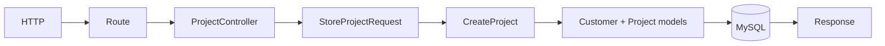

# 16. Services and Business Logic

[Previous](15-validation.md) · [Next](17-errors-and-exceptions.md)

A project-creation request has become meaningful: the customer must be active, and its organization must remain below `project_limit`. Putting these decisions in a controller couples HTTP to rules; putting them in `Customer` would make the ORM record orchestrate organization queries and creation. `CreateProject` is justified because it names this use case.



```sh
# active seeded customer: 201
curl -i -H 'X-Request-ID: project-ok' -H 'Content-Type: application/json' -d '{"name":"Migration readiness"}' http://localhost:8080/api/customers/1/projects
# inactive seeded customer: 409
curl -i -H 'X-Request-ID: project-rejected' -H 'Content-Type: application/json' -d '{"name":"Should not exist"}' http://localhost:8080/api/customers/2/projects
docker compose logs web | grep project-rejected
```

Transport concerns are method, JSON, and status. Validation establishes a usable name. The service orchestrates reads and creation and owns business decisions. Models persist. The controller maps success to `201`; centralized exception handling maps a known business rejection to `409`.

`TicketWorkflow` earns the same treatment: closed tickets cannot reopen, allowed transitions increment `version`, and rejected transitions do not save. Its unit test proves the decision without HTTP; feature tests prove exception-to-response behavior. We did not add repositories or interfaces because Eloquent is not yet a volatile boundary and those layers would hide rather than clarify.
