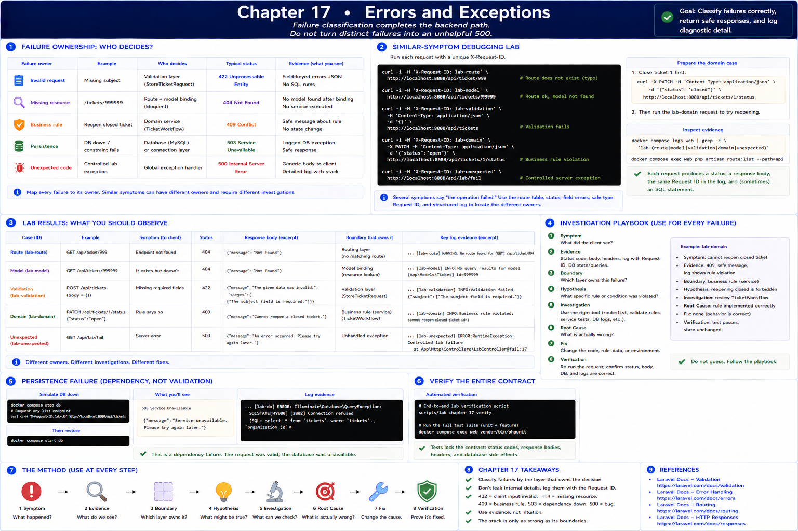

# 17. Errors and Exceptions

[Previous](16-services-and-business-logic.md) · [Book home](../../README.md)



Failure classification completes the backend path. Do not turn distinct failures into an unhelpful 500.

| Failure owner | Example | Status/evidence |
| --- | --- | --- |
| invalid request | missing `subject` | 422 field errors |
| missing resource | `/tickets/999999` | 404 after model binding |
| business rule | reopen closed ticket | 409 safe message |
| persistence | unavailable MySQL/constraint | logged database exception, safe response |
| unexpected code | controlled lab exception | 500 generic body, detailed structured log |

## Similar-symptom debugging lab

Run each request with a distinct `X-Request-ID`:

```sh
curl -i -H 'X-Request-ID: lab-route' http://localhost:8080/api/ticket/999
curl -i -H 'X-Request-ID: lab-model' http://localhost:8080/api/tickets/999999
curl -i -H 'X-Request-ID: lab-validation' -H 'Content-Type: application/json' -d '{}' http://localhost:8080/api/tickets
curl -i -H 'X-Request-ID: lab-domain' -X PATCH -H 'Content-Type: application/json' -d '{"status":"open"}' http://localhost:8080/api/tickets/1/status
curl -i -H 'X-Request-ID: lab-unexpected' http://localhost:8080/api/lab/fail
docker compose logs web | grep -E 'lab-(route|model|validation|domain|unexpected)'
docker compose exec web php artisan route:list --path=api
```

Prepare the domain case by first transitioning ticket 1 to `closed`. Several symptoms say “the operation failed,” but route table, status, field errors, safe type, request ID, and structured log locate different owners. For each write: **Symptom → Evidence → Boundary → Hypothesis → Investigation → Root Cause → Fix → Verification**. The unexpected response hides stack details while the local log retains exception class/message; never expose stack traces as an API contract.

Stop MySQL only after the other cases if you want the persistence variant: `docker compose stop db`, request a list, inspect logs, then `docker compose start db`. This is dependency failure, not validation. Verify the entire contract with:

```sh
scripts/lab chapter 17 verify
docker compose exec web vendor/bin/phpunit
```

At Part II's boundary you can now reconstruct: HTTP → route → controller → validation → service/business rule → Eloquent → MySQL → response, joined by request identity and checked at each important boundary. Authentication, richer API resources, and database internals remain later work.
