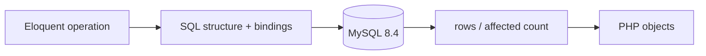

# 18. Read the SQL Behind Eloquent

[Previous](17-errors-and-exceptions.md) · [Next](19-joins-and-relationships.md)

Eloquent is a PHP interface to a separate system. It builds SQL, sends SQL structure plus bound values through PDO, MySQL executes it against rows, and Eloquent hydrates returned values into objects.



## Capture real operations

Reset to the known fixture, then run the read/write inspection inside a transaction that always rolls back:

```sh
make reset
docker compose exec web php artisan lab:database sql
```

The JSON lines expose a lookup, filter, relationship load, insert, update, and delete. A typical filter has SQL such as `where status = ?`; its next `bindings` entry contains `open`. The question mark is SQL structure, while the value is data sent separately. PDO parameter binding prevents a value from becoming SQL syntax; it does not make a logically wrong query correct. See [Laravel's query listener](https://laravel.com/docs/12.x/database#listening-for-query-events) and [PHP PDO prepared statements](https://www.php.net/manual/en/pdo.prepared-statements.php).

Run an equivalent read directly:

```sh
docker compose exec db mysql -urelaydesk -prelaydesk relaydesk \
  -e "SELECT id,subject,status FROM tickets WHERE status='open' ORDER BY id LIMIT 1;"
docker compose exec web php artisan tinker --execute='dump(App\Models\Ticket::where("status","open")->orderBy("id")->first()->toArray());'
```

The SQL client returns a result set. Eloquent turns a result row into a `Ticket`, applies casts, and can issue more SQL for relationships. Neither object methods nor `$fillable` exist in MySQL.

## Controlled misconception: a relationship property is free

`$customer->tickets` looks like property access, but the first access can execute a query. Run `php artisan lab:database relationships`: lazy loading performs the customer query and then one ticket query per customer. The code is reasonable PHP; the SQL event count reveals repeated work. Chapter 19 repairs it. SQL inspection is the evidence—not a guess based on how short the PHP looks.

**Verify:** the SQL lab ends by reporting rollback, and this must return zero:

```sh
docker compose exec db mysql -urelaydesk -prelaydesk relaydesk \
  -Nse "SELECT COUNT(*) FROM tickets WHERE subject='Chapter 18 temporary row';"
```
