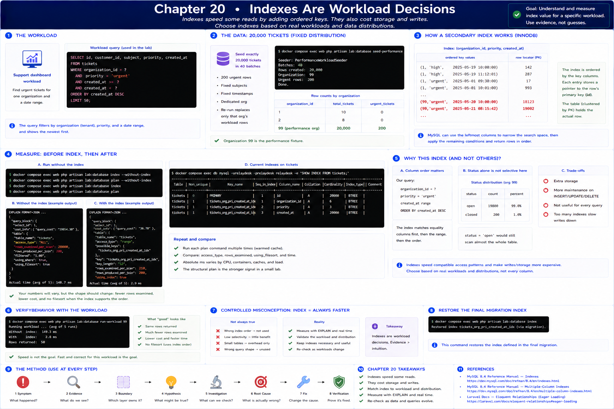

# 20. Indexes Are Workload Decisions

[Previous](19-joins-and-relationships.md) · [Next](21-query-plans.md)



A support dashboard repeatedly finds urgent tickets for one organization and date range. As rows grow, a full scan makes customers wait. The lab seeder creates exactly 20,000 tickets in 40 batches, fixed subjects/timestamps, 200 urgent rows, and a dedicated organization. Re-running replaces only that organization's workload rows.

```sh
docker compose exec web php artisan lab:database seed-performance
docker compose exec db mysql -urelaydesk -prelaydesk relaydesk -e \
 "SELECT organization_id,COUNT(*),SUM(priority='urgent') FROM tickets GROUP BY organization_id;"
```

An InnoDB secondary index conceptually keeps ordered key values plus a row locator. `(organization_id, priority, created_at)` lets MySQL narrow this query by its leftmost columns instead of examining unrelated ticket entries. It costs storage and extra maintenance on inserts/updates.

## Before, then after

```sh
docker compose exec web php artisan lab:database index --without-index
docker compose exec web php artisan lab:database plan --without-index
docker compose exec web php artisan lab:database index
docker compose exec web php artisan lab:database plan
docker compose exec db mysql -urelaydesk -prelaydesk relaydesk -e 'SHOW INDEX FROM tickets;'
```

Repeat runs and compare access/rows evidence as well as wall time. Absolute milliseconds vary with CPU, container resources, and warmed caches. The structural plan is the stronger small-lab signal. The second command restores the migration's final index.

`status` alone is poorly selective in this fixture because most tickets are open. Selectivity is workload- and distribution-dependent. Column order also matters: the composite index supports equality on organization and priority before the date range; it is not equally useful for every query. Do not index every column: an index speeds only compatible access patterns and makes writes/storage more expensive. See [MySQL's multiple-column index rules](https://dev.mysql.com/doc/refman/8.4/en/multiple-column-indexes.html).
