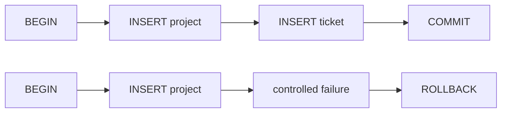

# 22. Transactions Define Atomic Business State

[Previous](21-query-plans.md) · [Next](23-concurrency.md)

Provisioning a project also creates its first work item. A project with no kickoff ticket is contradictory business state.



## First prove the defect

Only the explicit CLI lab can call `unsafeForLab`; no HTTP or production-style path reads a magic environment flag.

```sh
make reset
docker compose exec web php artisan lab:database transaction --unsafe --fail
docker compose exec db mysql -urelaydesk -prelaydesk relaydesk \
 -e "SELECT p.id,p.name,t.id AS ticket_id FROM projects p LEFT JOIN tickets t ON t.project_id=p.id ORDER BY p.id;"
```

The failure occurs after project INSERT. With no transaction, the project remains and its initial ticket is absent.

Reset, then run the atomic implementation:

```sh
make reset
docker compose exec web php artisan lab:database transaction --fail
docker compose exec web php artisan lab:database transaction
docker compose exec web vendor/bin/phpunit --filter=ProjectTransactionTest
```

On failure, Laravel's `DB::transaction` rolls back both the write and its visible business outcome. On success, both commit. Atomicity means other work sees the entire provisioned project or none of it—not merely that code uses transaction syntax. Transactions do not validate inputs or solve every race. [Laravel documents automatic commit and rollback](https://laravel.com/docs/12.x/database#database-transactions); MySQL documents [InnoDB transaction statements](https://dev.mysql.com/doc/refman/8.4/en/commit.html).
