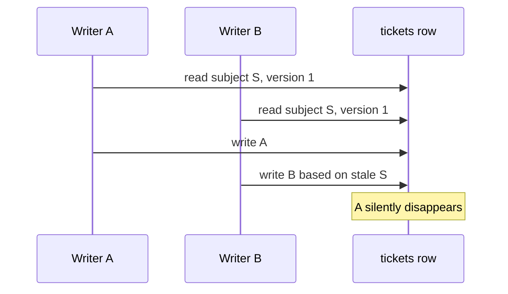

# 23. Concurrency and Lost Updates

[Previous](22-transactions.md) · [Next](24-data-integrity.md)

Two correct request handlers can produce a wrong result when execution interleaves. The lab uses two snapshots read before either write; no frantic browser clicking or timing assumption is involved.



```sh
make reset
docker compose exec web php artisan lab:database concurrency
docker compose exec web vendor/bin/phpunit --filter=OptimisticConcurrencyTest
```

The first phase deliberately saves detached Eloquent snapshots. B's later update silently overwrites A. Both local code paths were valid; their interleaving was not.

RelayDesk then uses optimistic concurrency for user-edited ticket values: `UPDATE tickets SET ..., version=2 WHERE id=? AND version=1`. Exactly one writer changes a row. The stale writer affects zero rows and receives `StaleTicket`, so it must reload and reconcile rather than erase work. The final JSON proves B was rejected.

Alternatives solve different shapes. `UPDATE counters SET value=value+1` is an atomic update for commutative counters. `SELECT ... FOR UPDATE` plus a short transaction serializes decisions that must inspect several values, at the cost of waiting and deadlock handling. Optimistic version checks suit infrequent collisions and visible editing. There is no universal concurrency primitive; define the invariant and expected contention first. See [Laravel pessimistic locking](https://laravel.com/docs/12.x/queries#pessimistic-locking) and MySQL [locking reads](https://dev.mysql.com/doc/refman/8.4/en/innodb-locking-reads.html).
