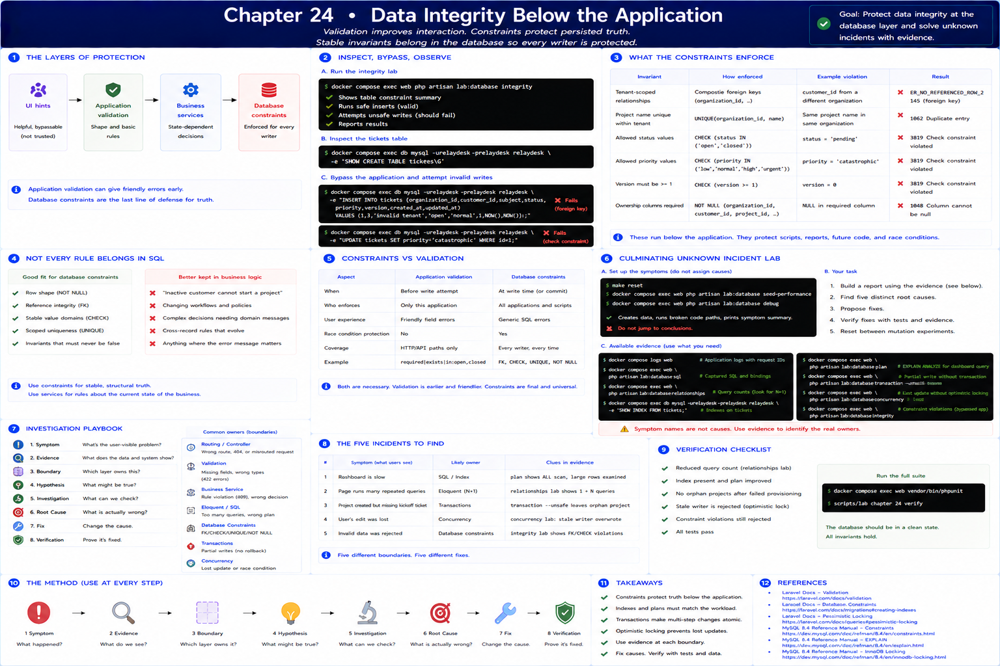
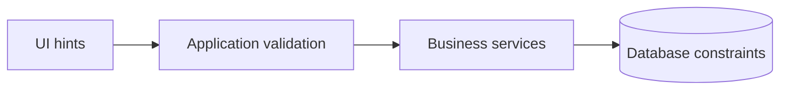

# 24. Data Integrity Below the Application

[Previous](23-concurrency.md) · [Next](25-javascript-in-the-browser.md)





Validation improves interaction; constraints protect persisted truth. RelayDesk's final Part III migration adds composite tenant foreign keys, scoped project-name uniqueness, status/priority/version checks, and required (`NOT NULL`) ownership columns. MySQL 8.4 enforces `CHECK`; this lab intentionally depends on the pinned `mysql:8.4` image.

## Inspect, bypass, observe

```sh
docker compose exec web php artisan lab:database integrity
docker compose exec db mysql -urelaydesk -prelaydesk relaydesk -e 'SHOW CREATE TABLE tickets\G'
docker compose exec db mysql -urelaydesk -prelaydesk relaydesk -e \
 "INSERT INTO tickets (organization_id,customer_id,subject,status,priority,version,created_at,updated_at) VALUES (1,3,'invalid tenant','open','normal',1,NOW(),NOW());"
docker compose exec db mysql -urelaydesk -prelaydesk relaydesk -e \
 "UPDATE tickets SET priority='catastrophic' WHERE id=1;"
```

Both statements bypass Form Requests. The composite foreign key rejects the cross-tenant relationship; the check rejects the invalid stored value. A missing parent is rejected by a foreign key, duplicate project identity by `UNIQUE`, and a missing required owner by `NOT NULL`. Application validation can return friendly field errors before attempting a write. A database violation is later and less friendly, but it protects every writer and closes validation races.

Not every rule belongs in SQL. “An inactive customer cannot start a project” is a changing workflow decision with useful domain messaging, so `CreateProject` owns it. Stable row/reference invariants that must survive scripts, concurrent requests, and future code belong in constraints too. [MySQL documents constraint enforcement](https://dev.mysql.com/doc/refman/8.4/en/create-table-check-constraints.html) and [foreign keys](https://dev.mysql.com/doc/refman/8.4/en/create-table-foreign-keys.html).

## Culminating unknown incident

Run only the symptom setup first:

```sh
make reset
docker compose exec web php artisan lab:database seed-performance
docker compose exec web php artisan lab:database debug
```

Do not assign causes from the symptom names. Produce a report using **Symptom → Evidence → Boundary → Hypothesis → Investigation → Root Cause → Fix → Verification**. Available evidence:

```sh
docker compose logs web
docker compose exec web php artisan lab:database sql
docker compose exec web php artisan lab:database relationships
docker compose exec db mysql -urelaydesk -prelaydesk relaydesk -e 'SHOW INDEX FROM tickets;'
docker compose exec web php artisan lab:database plan
docker compose exec web php artisan lab:database transaction --unsafe --fail
docker compose exec web php artisan lab:database concurrency
docker compose exec web php artisan lab:database integrity
```

Investigate repeated queries, a workload access path, partial provisioning, a stale overwrite, and rejected invalid state. Reset between mutation experiments. Verification is reduced query count, restored index/plan evidence, rollback behavior, rejected stale writer, constraint errors, and the full test suite—not “the code looks cleaner.” Part III is complete when you can move from Eloquent to SQL to plan/state/constraints and explain the transaction and concurrency boundary.
