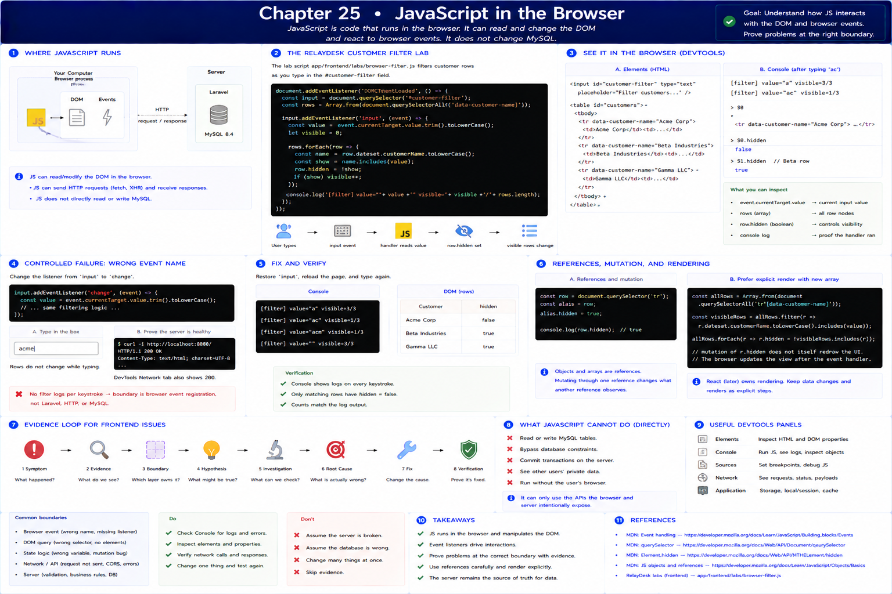
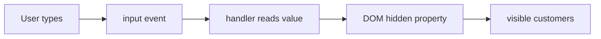

# 25. JavaScript in the Browser

[Previous](24-data-integrity.md) · [Next](26-asynchronous-javascript.md)

The browser has already parsed HTTP into a document. JavaScript is code running in that browser process: it can read the DOM, listen for browser events, and change the displayed document. It does not silently change MySQL.

Open the existing RelayDesk page and DevTools **Elements** and **Console** panels. The precursor in `app/frontend/labs/browser-filter.js` uses a business interaction rather than an unrelated toy: a customer filter. `querySelector` finds nodes; an `input` event supplies the current value; the handler changes each row's `hidden` DOM property.

Run the snippet against a page containing `#customer-filter` and `[data-customer-name]`, or reproduce those elements in the Elements panel. Inspect `event.currentTarget.value`, the `rows` array, and the DOM before and after typing. The console log is evidence that the handler ran.

## Controlled failure: the server is healthy, the interaction is not

Change the listener name from `input` to `change`. Typing no longer filters immediately. First prove `curl -i http://localhost:8080/` returns HTML and DevTools Network reports 200. Then observe that no `filter event` log appears per keystroke. The boundary is browser event registration—not Laravel, HTTP, or MySQL. Restore `input`, reload, and verify visible count and DOM properties.

Objects and arrays are references. Mutating an object through one reference changes what another reference observes; it does not itself instruct the DOM to redraw. Prefer a new filtered array and an explicit render step. This distinction becomes important when React owns rendering.

Evidence loop: **Symptom → Console/DOM evidence → browser boundary → event-name hypothesis → listener inspection → fix → type and verify**. See [MDN event handling](https://developer.mozilla.org/en-US/docs/Learn_web_development/Core/Scripting/Events) and [DOM querying](https://developer.mozilla.org/en-US/docs/Web/API/Document/querySelector).
