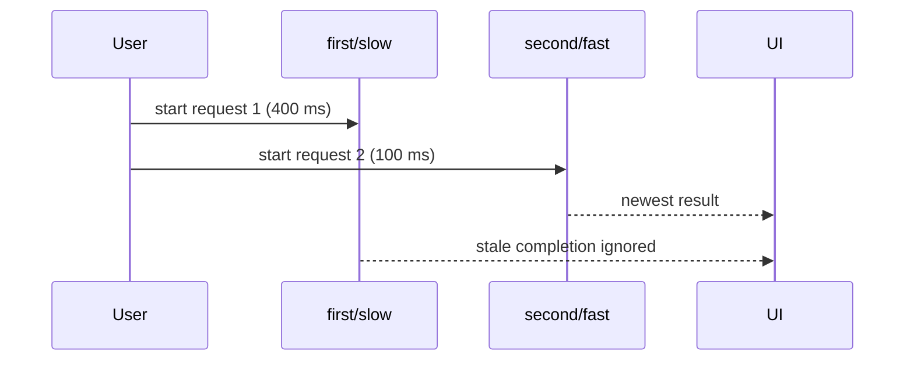

# 26. Asynchronous JavaScript

[Previous](25-javascript-in-the-browser.md) · [Next](27-why-typescript-exists.md)

Some browser work completes later. A promise represents that future completion; `await` pauses only the surrounding `async` function, not the browser. Fulfillment supplies a value and rejection supplies an error. `try`/`catch` handles awaited rejection.

Run `app/frontend/labs/async-race.js` in a page after adding `

`. Its delays are fixed at 400 ms and 100 ms—no internet or scheduler luck is required.

`console.time` makes ordering visible. Both operations return correct labels, yet completion order differs from start order. Remove the request-number guard: `second/fast` renders, then `first/slow` incorrectly overwrites it. The bug belongs to timing/state ownership, not value calculation.

The guard defines “latest intent wins.” `AbortController` is another useful policy when an operation supports cancellation; `app/frontend/src/hooks/useTickets.ts` cancels an obsolete fixture load during effect cleanup. Cancellation is not a substitute for displaying failures. RelayDesk models `idle`, `loading`, `success`, `empty`, and `error` explicitly in `LoadState`.

Repeat the lab several times: the same log order and final result must occur. Then activate the repository's controlled `fail` option and verify an error transition rather than an endless loading message. See [MDN promises](https://developer.mozilla.org/en-US/docs/Web/JavaScript/Guide/Using_promises), [`async function`](https://developer.mozilla.org/en-US/docs/Web/JavaScript/Reference/Statements/async_function), and [`AbortController`](https://developer.mozilla.org/en-US/docs/Web/API/AbortController).
