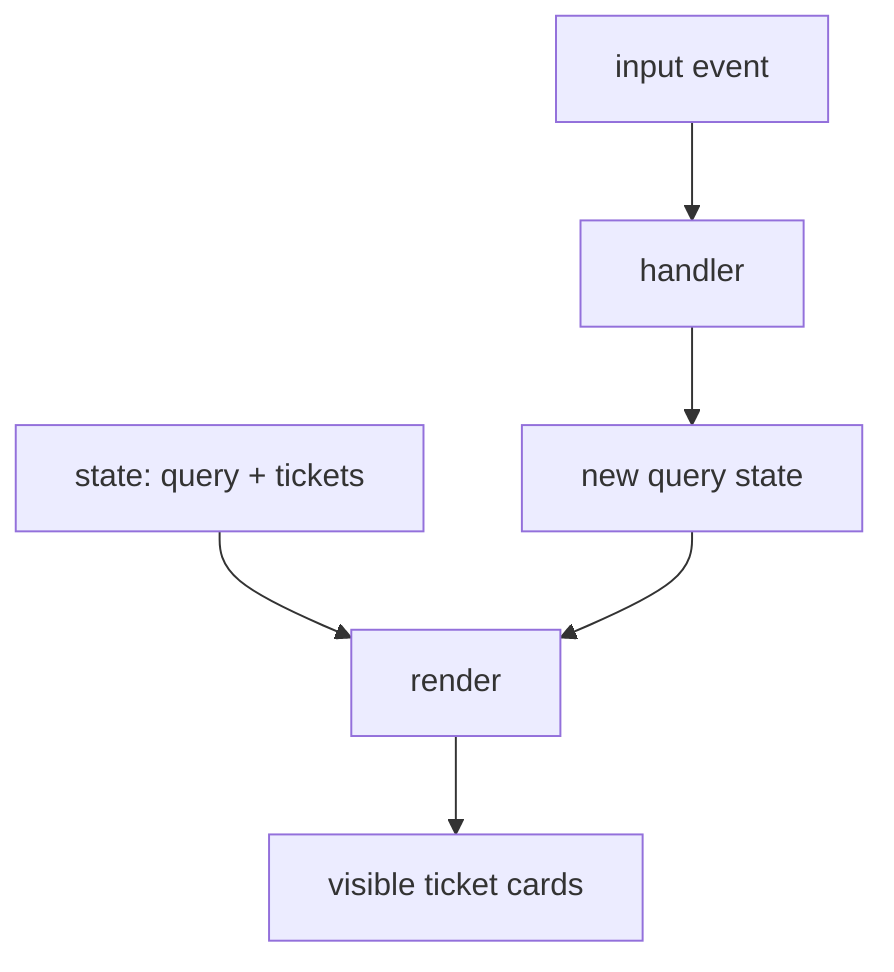

# 28. React's Mental Model

[Previous](27-why-typescript-exists.md) · [Next](29-components-and-props.md)

The imperative filter forced code to decide which DOM nodes to find and mutate. React solves the growing coordination problem with a different rule: **UI is derived from state**. A component render calculates React elements; React commits the necessary DOM changes.

Run `npm run dev` in `app` and open the printed Vite URL. `TicketsPage` owns `query`. Its input handler calls `setQuery`; rendering derives `visible`; `TicketList` describes the new UI. Do not manually hide card DOM nodes. Search the same business data for “migration” and inspect renders with React DevTools if installed.

State is a snapshot for one render. Calling a setter requests another render; it does not mutate the current variable. Rendering must be pure: given the same props/state it should return the same description without writing storage, starting timers, or changing `document.title`. React Strict Mode deliberately helps expose impure render logic in development.

Controlled failure: move `document.title = subject` into a component body and observe repeated external writes as renders occur. The page may appear correct while the render boundary is wrong. Remove it; Chapter 31 places external synchronization in an effect. Verify the filter through visible behavior with `npm run test:frontend`.

See React's documentation on [render and commit](https://react.dev/learn/render-and-commit), [state as a snapshot](https://react.dev/learn/state-as-a-snapshot), and [keeping components pure](https://react.dev/learn/keeping-components-pure).
