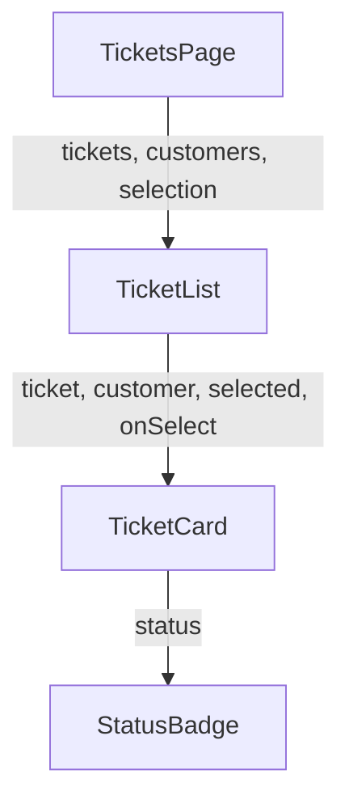

# 29. Components and Props

[Previous](28-reacts-mental-model.md) · [Next](30-state-and-events.md)

As the ticket UI gains customer identity, status, priority, selection, and links, one render function becomes difficult to inspect. Decompose at business responsibilities: `TicketsPage` coordinates the view, `TicketList` composes a collection, `TicketCard` represents one ticket, and `StatusBadge` renders a repeated domain label.

Props are inputs chosen by the parent. Data flows down; an event callback flows down too, then reports an event upward. Children must not mutate props. `TicketCard` is not split into components for every heading or button because those boundaries would add names without isolating responsibility.

Controlled props failure: temporarily pass `customer={customers[0]}` for every card. Fixture data and Laravel remain correct, yet ticket 3 displays the wrong customer. Inspect the card's received props with React DevTools and compare `ticket.customerId`; repair the lookup by ID. A component behavior test should assert the visible customer, not its internal function calls.

Composition means the parent assembles business pieces; it does not mean global access to all data. One-way data flow makes the source of a wrong label traceable: rendered text ← card prop ← list mapping ← page data. See React's [components and props](https://react.dev/learn/passing-props-to-a-component).
