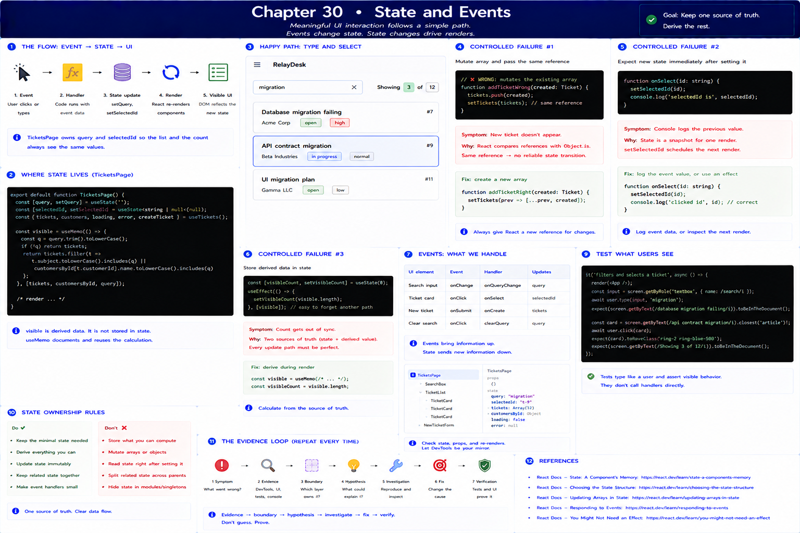

# 30. State and Events

[Previous](29-components-and-props.md) · [Next](31-hooks-and-effects.md)

RelayDesk now has meaningful interaction: filter the queue and select a ticket. The path is **click/input event → handler → state transition → render → visible UI**. `TicketsPage` owns both values because sibling cards and the count need a consistent view.

`visible` is derived from `tickets` and `query`. It is not separate state. Storing it would create two sources of truth: a later ticket insertion could update `tickets` while `visibleTickets` remained stale. `useMemo` here documents/reuses a calculation; it does not change ownership.

Controlled failures:

1. Mutate an array with `tickets.push(...)` and pass the same reference. React has no reliable state transition to observe. Create a new array with `[...current, created]` as `useTickets` does.
2. Call `setSelectedId(id)` and immediately log `selectedId`; the log belongs to the old render snapshot. Log the event's `id`, or inspect the next render.
3. Store the visible count in state. Change the filter and observe disagreement unless every update path is synchronized. Delete redundant state and calculate `visible.length`.

Use React DevTools component state, browser events, and the visible “Showing N of M” status as independent evidence. Tests in `app/frontend/test/App.test.tsx` type as a user and assert rendered behavior rather than invoking handlers directly. See React's guidance on [choosing state structure](https://react.dev/learn/choosing-the-state-structure) and [updating arrays](https://react.dev/learn/updating-arrays-in-state).
