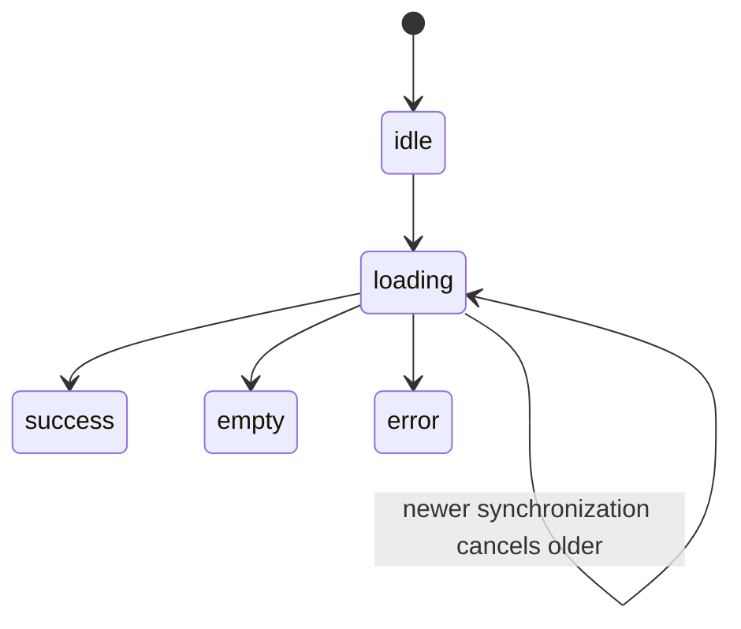

# 31. Hooks and Effects

[Previous](30-state-and-events.md) · [Next](32-forms-and-validation.md)

`useState` retains component-owned snapshots. `useEffect` has a narrower purpose: synchronize React state/props with a system outside React—timers, subscriptions, browser APIs, or an async data source. It is not merely “code after render,” and ordinary derived values do not belong in effects.

`useTickets(repository)` synchronizes with an injected fixture repository. Its effect starts a load; cleanup aborts obsolete work; the dependency list names the repository-backed `load` callback used by synchronization. The repository returns deterministic copies after 300 ms and can produce a controlled error.

Inspect `app/frontend/labs/effect-failures.tsx`. Omitting `selected` creates a stale closure; adding an unconditional state write can loop; omitting cleanup leaves external document state behind after unmount. Adding an unstable object to dependencies can repeat synchronization every render. Fix the ownership rather than silencing the linter.

Effects may run setup/cleanup an extra time in React 19 development Strict Mode. Correct synchronization tolerates that. `AbortController` prevents an old completion from updating current UI; it also avoids pretending cancellation is an error. Use `npm run lint` to check dependency evidence and `npm run test:frontend` to observe loading-to-success behavior. See React's [synchronizing with effects](https://react.dev/learn/synchronizing-with-effects) and [effect lifecycle](https://react.dev/learn/lifecycle-of-reactive-effects).
