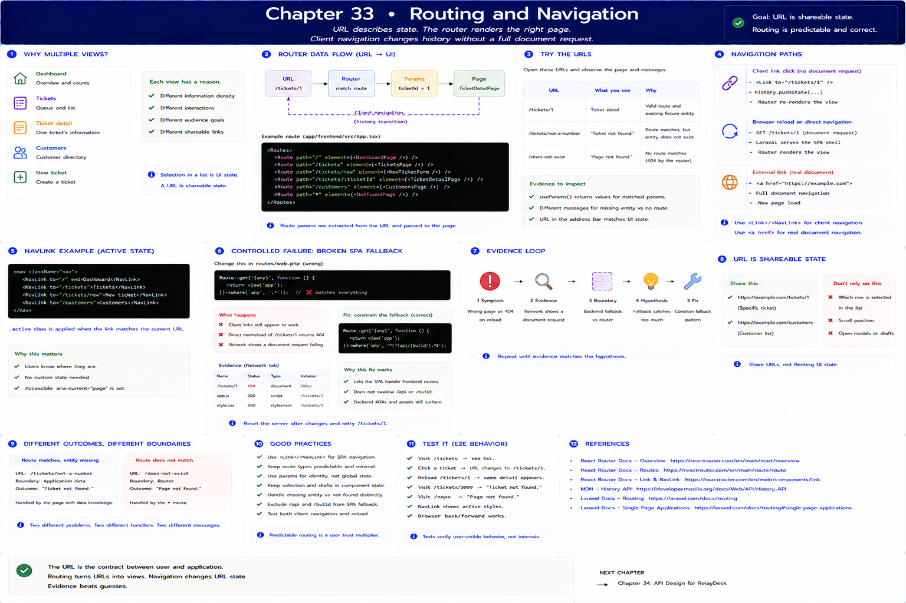
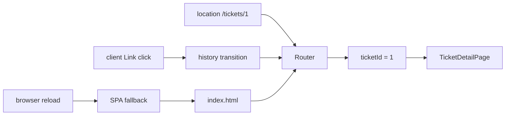

# 33. Routing and Navigation

[Previous](32-forms-and-validation.md) · [Next](34-frontend-architecture.md)

Multiple justified views now exist: dashboard, ticket queue, ticket detail, customers, and ticket creation. React Router 7.8.2 maps URL state to page elements. A `NavLink` transition updates browser history and renders without requesting another HTML document; typing/reloading a URL makes the browser request that path from Laravel.

Open `/tickets/1`, inspect `useParams`, then visit `/tickets/not-a-number` and `/does-not-exist`. Missing entity and unmatched route are intentionally different messages. The URL is evidence and shareable state; selection inside the list is deliberately ephemeral UI state.

Controlled failure: change the Laravel SPA fallback to serve only `/`. Client links still appear to work, but direct navigation/reload of `/tickets/1` returns a backend 404. Network evidence shows a document request, not a fixture/API failure. Restore the constrained fallback in `routes/web.php`; it excludes `/api` and `/build`, so frontend routing does not swallow backend or asset failures.

Use `<Link>`/`<NavLink>` for client navigation and ordinary anchors when a real document navigation is intended. See React Router's [routing documentation](https://reactrouter.com/start/declarative/routing) and MDN's [History API](https://developer.mozilla.org/en-US/docs/Web/API/History_API).
