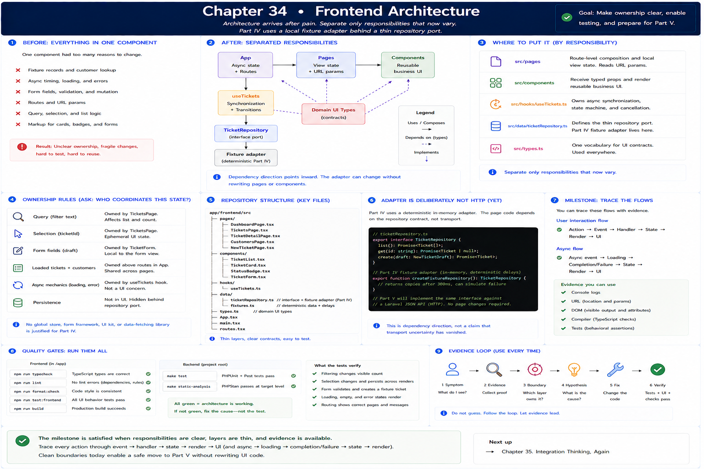
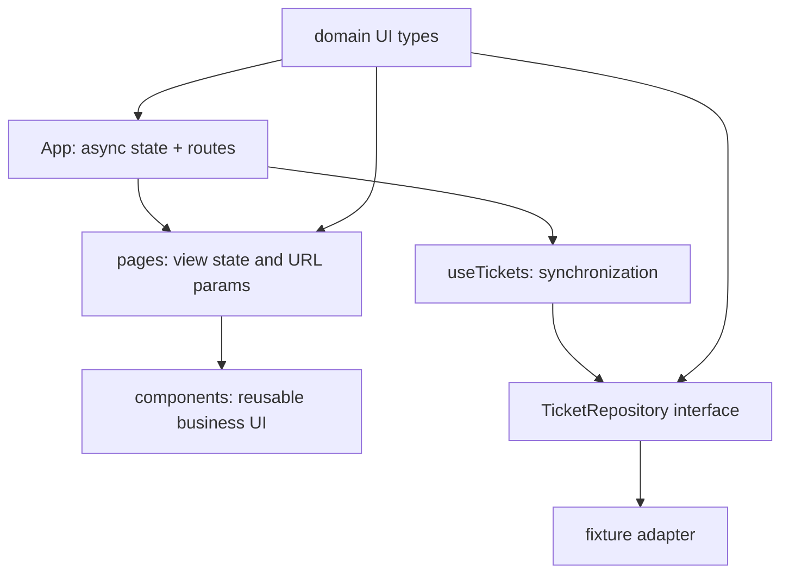

# 34. Frontend Architecture

[Previous](33-routing-and-navigation.md) · [Book home](../../README.md)

Architecture arrives after pain. A single component had fixture records, async timing, form mutation, routes, customer lookup, and markup. That made data ownership unclear and tests expensive. RelayDesk separates only responsibilities that now vary.

- `src/pages` owns route-level composition and local view state.
- `src/components` receives typed props and renders reusable ticket/form concepts.
- `src/hooks/useTickets.ts` owns async synchronization and transitions.
- `src/data/ticketRepository.ts` defines the thin port and deterministic Part IV adapter.
- `src/types.ts` provides one vocabulary for UI contracts.

Ask **who needs to coordinate this state?** Query and selection stay in `TicketsPage`; form fields stay in `TicketForm`; loaded records live above routes in `App`; async mechanics live in the hook; persistence does not leak into cards. No global store, form framework, UI kit, or data-fetching library is justified.

The adapter is deliberately not HTTP. Part V can implement the same repository contract against a designed Laravel JSON API without rewriting pages. This is dependency direction, not a claim that transport uncertainty has vanished.

Run all frontend checks (`npm run typecheck`, `npm run lint`, `npm run format:check`, `npm run test:frontend`, `npm run build`) and backend checks (`make test`). The milestone is satisfied when you can trace action → event → handler → state → render → UI, and async event → loading → completion/failure → state → render, using console, URL, DOM, compiler, and tests as evidence.
