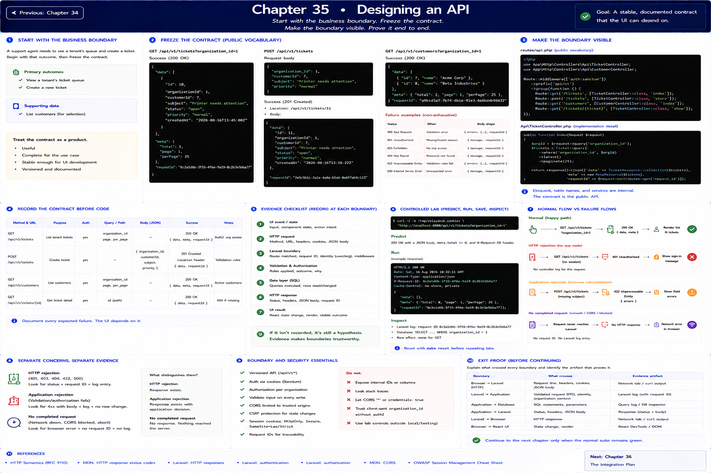

# Chapter 35: Designing an API

Previous: [Chapter 34](./34-frontend-architecture.md)



## Start with the business boundary

A support agent needs to see a tenant's queue and create a ticket. Begin with that outcome, then freeze the contract: `GET /api/v1/tickets?organization_id=1` returns `{data, meta, requestId}`; `POST /api/v1/tickets` accepts `{organization_id, customerId, subject, priority}` and returns `201`, a `Location` header, and `{data, requestId}`. Customers are a supporting resource at `GET /api/v1/customers`.

## Make the boundary visible

Compare `routes/api.php` with `ApiTicketController`. Routes are the public vocabulary; Eloquent, table names, and service arrangement are internal. The camel-case DTO deliberately differs from database columns. Record method, URL, headers, body, success, and each expected failure before writing UI code.

## Evidence checklist

At each boundary record: event/state; method and URL; request headers, cookie, and JSON body; route, request ID, identity, validation and authorization; SQL/row effect; response status, headers and JSON; final React state/render. An explanation without an artifact is still a hypothesis.

## Controlled lab and verification

```sh
curl -i -b /tmp/relaydesk.cookies 'http://localhost:8080/api/v1/tickets?organization_id=1'
```

Predict the observation first, run it, save the status/body and `X-Request-ID`, then inspect the matching log and database row. Reset with `make reset`; never use lab controls outside local/testing.

## References

- [HTTP Semantics (RFC 9110)](https://www.rfc-editor.org/rfc/rfc9110)
- [MDN: HTTP response status codes](https://developer.mozilla.org/en-US/docs/Web/HTTP/Reference/Status)
- [Laravel: HTTP responses](https://laravel.com/docs/12.x/responses)
- [Laravel: authentication](https://laravel.com/docs/12.x/authentication)
- [Laravel: authorization](https://laravel.com/docs/12.x/authorization)
- [MDN: CORS](https://developer.mozilla.org/en-US/docs/Web/HTTP/Guides/CORS)
- [OWASP Session Management Cheat Sheet](https://cheatsheetseries.owasp.org/cheatsheets/Session_Management_Cheat_Sheet.html)

## Exit proof

Explain what crossed every boundary and identify which artifact would distinguish HTTP rejection, application rejection, and no completed request. Continue to the next chapter only when the normal suite remains green.

Next: [Chapter 36](./36-json-and-serialization.md)
