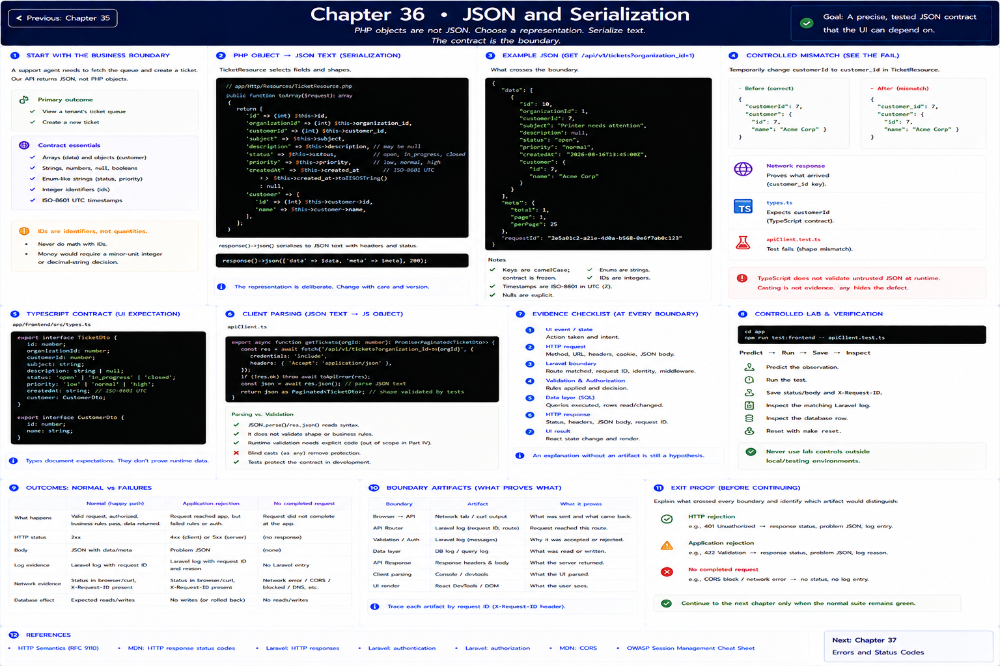

# Chapter 36: JSON and Serialization

Previous: [Chapter 35](./35-designing-an-api.md)



## Start with the business boundary

A PHP object is not JSON. `TicketResource` selects a representation and `JSON.stringify`/`response.json()` serialize and parse JSON text. The contract contains arrays, strings, numbers, `null` descriptions, nested customer objects, enum-like status strings, integer identifiers, and ISO-8601 UTC timestamps. IDs are identifiers, not quantities; money would require an integer minor-unit or decimal-string decision.

## Make the boundary visible

Controlled mismatch: temporarily change `customerId` to `customer_id` in `TicketResource`. Network response proves what arrived, `types.ts` proves what TypeScript expects, and `apiClient.test.ts` protects the shape. Observe that TypeScript does not validate untrusted JSON at runtime; a cast is not evidence, and `any` merely hides the defect.

## Evidence checklist

At each boundary record: event/state; method and URL; request headers, cookie, and JSON body; route, request ID, identity, validation and authorization; SQL/row effect; response status, headers and JSON; final React state/render. An explanation without an artifact is still a hypothesis.

## Controlled lab and verification

```sh
cd app && npm run test:frontend -- apiClient.test.ts
```

Predict the observation first, run it, save the status/body and `X-Request-ID`, then inspect the matching log and database row. Reset with `make reset`; never use lab controls outside local/testing.

## References

- [HTTP Semantics (RFC 9110)](https://www.rfc-editor.org/rfc/rfc9110)
- [MDN: HTTP response status codes](https://developer.mozilla.org/en-US/docs/Web/HTTP/Reference/Status)
- [Laravel: HTTP responses](https://laravel.com/docs/12.x/responses)
- [Laravel: authentication](https://laravel.com/docs/12.x/authentication)
- [Laravel: authorization](https://laravel.com/docs/12.x/authorization)
- [MDN: CORS](https://developer.mozilla.org/en-US/docs/Web/HTTP/Guides/CORS)
- [OWASP Session Management Cheat Sheet](https://cheatsheetseries.owasp.org/cheatsheets/Session_Management_Cheat_Sheet.html)

## Exit proof

Explain what crossed every boundary and identify which artifact would distinguish HTTP rejection, application rejection, and no completed request. Continue to the next chapter only when the normal suite remains green.

Next: [Chapter 37](./37-rest-and-http-semantics.md)
