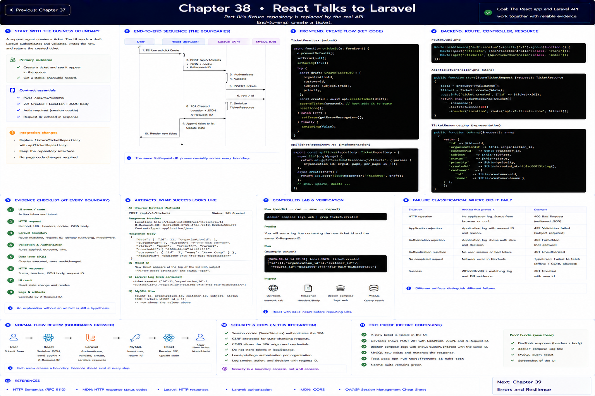
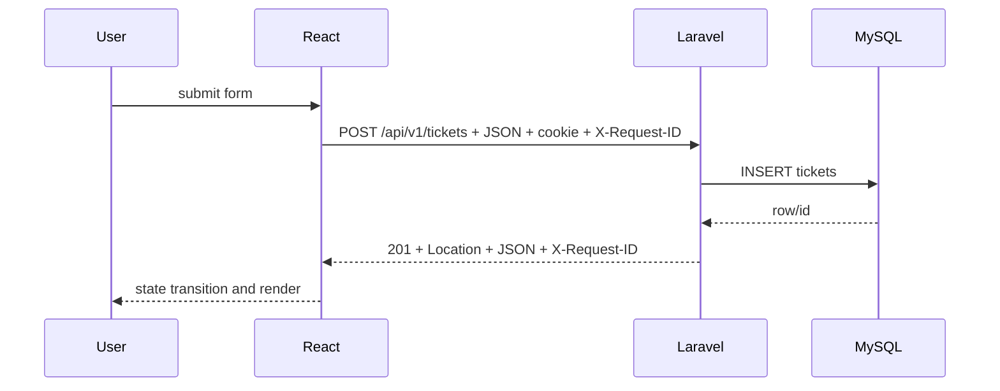

# Chapter 38: React Talks to Laravel

Previous: [Chapter 37](./37-rest-and-http-semantics.md)



## Start with the business boundary

Part IV's `fixtureTicketRepository` is replaced in the running application by `apiTicketRepository`. `TicketForm` creates a typed draft, the client serializes it, Laravel authenticates and validates, Eloquent inserts it, a resource serializes it, and the hook appends the returned row.

## Make the boundary visible


Prove causality with the same request ID in DevTools, response header/body, `docker compose logs web`, and the row queried in MySQL.

## Evidence checklist

At each boundary record: event/state; method and URL; request headers, cookie, and JSON body; route, request ID, identity, validation and authorization; SQL/row effect; response status, headers and JSON; final React state/render. An explanation without an artifact is still a hypothesis.

## Controlled lab and verification

```sh
docker compose logs web | grep ticket.created
```

Predict the observation first, run it, save the status/body and `X-Request-ID`, then inspect the matching log and database row. Reset with `make reset`; never use lab controls outside local/testing.

## References

- [HTTP Semantics (RFC 9110)](https://www.rfc-editor.org/rfc/rfc9110)
- [MDN: HTTP response status codes](https://developer.mozilla.org/en-US/docs/Web/HTTP/Reference/Status)
- [Laravel: HTTP responses](https://laravel.com/docs/12.x/responses)
- [Laravel: authentication](https://laravel.com/docs/12.x/authentication)
- [Laravel: authorization](https://laravel.com/docs/12.x/authorization)
- [MDN: CORS](https://developer.mozilla.org/en-US/docs/Web/HTTP/Guides/CORS)
- [OWASP Session Management Cheat Sheet](https://cheatsheetseries.owasp.org/cheatsheets/Session_Management_Cheat_Sheet.html)

## Exit proof

Explain what crossed every boundary and identify which artifact would distinguish HTTP rejection, application rejection, and no completed request. Continue to the next chapter only when the normal suite remains green.

Next: [Chapter 39](./39-loading-errors-empty-states.md)
