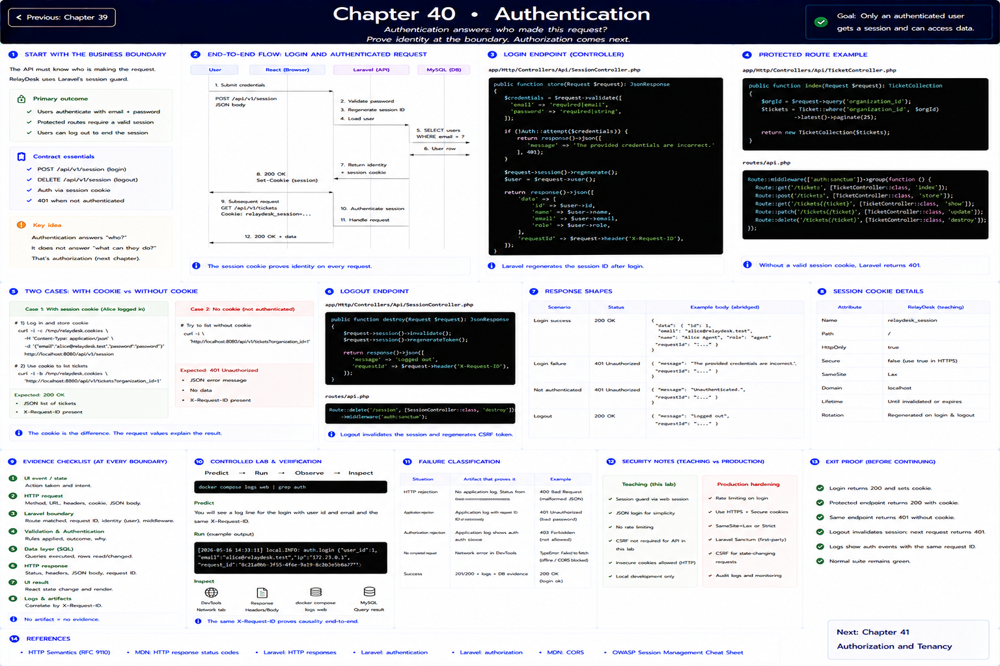

# Chapter 40: Authentication

Previous: [Chapter 39](./39-loading-errors-empty-states.md)



## Start with the business boundary

Authentication answers **who made this request?** RelayDesk uses Laravel's session guard with real seeded users. POST credentials to `/api/v1/session`; Laravel verifies the password, regenerates the session identifier, and returns the current identity. Protected endpoints return `401` without a valid session. DELETE logs out, invalidates the session, and regenerates the CSRF token.

## Make the boundary visible

Case one: log in as Alice and list. Case two: omit the cookie and repeat. The request values—not a hidden UI button—explain the difference. This teaching implementation keeps login JSON compact; production hardening should add rate limiting and Laravel Sanctum's first-party CSRF flow before Internet exposure.

## Evidence checklist

At each boundary record: event/state; method and URL; request headers, cookie, and JSON body; route, request ID, identity, validation and authorization; SQL/row effect; response status, headers and JSON; final React state/render. An explanation without an artifact is still a hypothesis.

## Controlled lab and verification

```sh
curl -i -c /tmp/relaydesk.cookies -H 'Content-Type: application/json' -d '{"email":"alice@relaydesk.test","password":"password"}' http://localhost:8080/api/v1/session
```

Predict the observation first, run it, save the status/body and `X-Request-ID`, then inspect the matching log and database row. Reset with `make reset`; never use lab controls outside local/testing.

## References

- [HTTP Semantics (RFC 9110)](https://www.rfc-editor.org/rfc/rfc9110)
- [MDN: HTTP response status codes](https://developer.mozilla.org/en-US/docs/Web/HTTP/Reference/Status)
- [Laravel: HTTP responses](https://laravel.com/docs/12.x/responses)
- [Laravel: authentication](https://laravel.com/docs/12.x/authentication)
- [Laravel: authorization](https://laravel.com/docs/12.x/authorization)
- [MDN: CORS](https://developer.mozilla.org/en-US/docs/Web/HTTP/Guides/CORS)
- [OWASP Session Management Cheat Sheet](https://cheatsheetseries.owasp.org/cheatsheets/Session_Management_Cheat_Sheet.html)

## Exit proof

Explain what crossed every boundary and identify which artifact would distinguish HTTP rejection, application rejection, and no completed request. Continue to the next chapter only when the normal suite remains green.

Next: [Chapter 41](./41-authorization-and-permissions.md)
