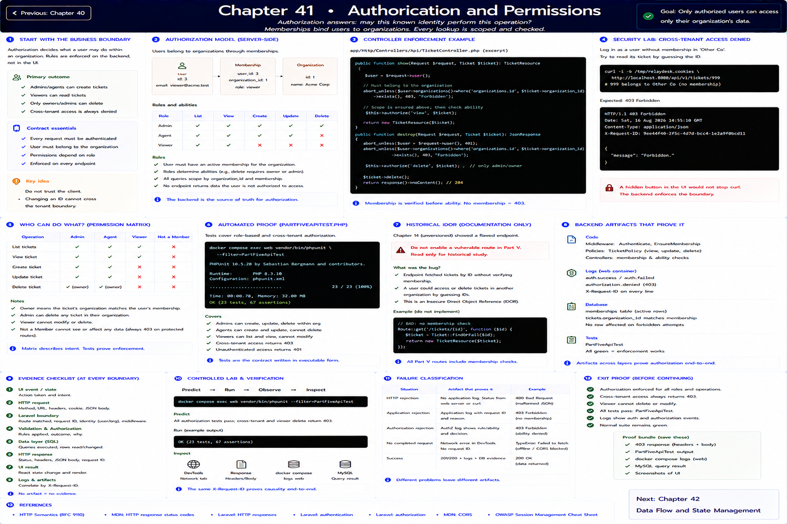

# Chapter 41: Authorization and Permissions

Previous: [Chapter 40](./40-authentication.md)



## Start with the business boundary

Authorization asks whether this known identity may perform this operation. Active memberships bind users to organizations. Admins/agents create; viewers read; only owners/admins delete. Every lookup checks membership on the backend, so changing an ID cannot cross the tenant boundary.

## Make the boundary visible

Security lab: log in as a user without membership in Other Co and manually request its ticket. A hidden frontend control would not stop curl. The production endpoint returns `403`; `PartFiveApiTest` proves viewer denial and cross-tenant denial. To study the historical IDOR, read the unversioned Chapter 14 endpoint—do not enable a vulnerable Part V route. Lab vulnerabilities are documentation-only, not active behavior.

## Evidence checklist

At each boundary record: event/state; method and URL; request headers, cookie, and JSON body; route, request ID, identity, validation and authorization; SQL/row effect; response status, headers and JSON; final React state/render. An explanation without an artifact is still a hypothesis.

## Controlled lab and verification

```sh
docker compose exec web vendor/bin/phpunit --filter=PartFiveApiTest
```

Predict the observation first, run it, save the status/body and `X-Request-ID`, then inspect the matching log and database row. Reset with `make reset`; never use lab controls outside local/testing.

## References

- [HTTP Semantics (RFC 9110)](https://www.rfc-editor.org/rfc/rfc9110)
- [MDN: HTTP response status codes](https://developer.mozilla.org/en-US/docs/Web/HTTP/Reference/Status)
- [Laravel: HTTP responses](https://laravel.com/docs/12.x/responses)
- [Laravel: authentication](https://laravel.com/docs/12.x/authentication)
- [Laravel: authorization](https://laravel.com/docs/12.x/authorization)
- [MDN: CORS](https://developer.mozilla.org/en-US/docs/Web/HTTP/Guides/CORS)
- [OWASP Session Management Cheat Sheet](https://cheatsheetseries.owasp.org/cheatsheets/Session_Management_Cheat_Sheet.html)

## Exit proof

Explain what crossed every boundary and identify which artifact would distinguish HTTP rejection, application rejection, and no completed request. Continue to the next chapter only when the normal suite remains green.

Next: [Chapter 42](./42-cookies-sessions-and-tokens.md)
