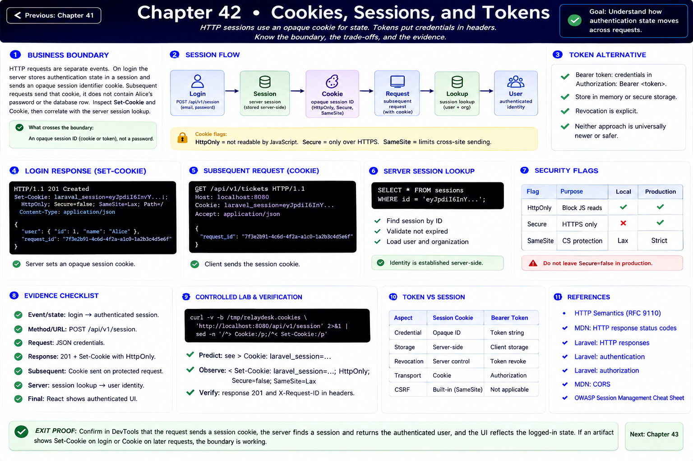
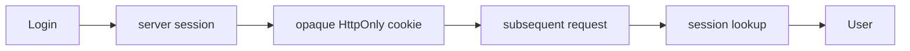

# Chapter 42: Cookies, Sessions, and Tokens

Previous: [Chapter 41](./41-authorization-and-permissions.md)



## Start with the business boundary

HTTP requests are separate events. On login the server stores authentication state in a session and sends an opaque session identifier cookie. Subsequent requests send that cookie; it does not contain Alice's password or the database row. Inspect `Set-Cookie` and `Cookie`, then correlate with the server session lookup.

## Make the boundary visible


`HttpOnly` blocks JavaScript reads, `Secure` limits transport to HTTPS, and `SameSite` constrains cross-site sending. Local HTTP uses Secure=false; deployment must enable it. Bearer tokens put credentials in an Authorization header and shift storage/revocation trade-offs; neither approach is universally newer or safer.

## Evidence checklist

At each boundary record: event/state; method and URL; request headers, cookie, and JSON body; route, request ID, identity, validation and authorization; SQL/row effect; response status, headers and JSON; final React state/render. An explanation without an artifact is still a hypothesis.

## Controlled lab and verification

```sh
curl -v -b /tmp/relaydesk.cookies 'http://localhost:8080/api/v1/session' 2>&1 | sed -n '/^> Cookie:/p;/^< Set-Cookie:/p'
```

Predict the observation first, run it, save the status/body and `X-Request-ID`, then inspect the matching log and database row. Reset with `make reset`; never use lab controls outside local/testing.

## References

- [HTTP Semantics (RFC 9110)](https://www.rfc-editor.org/rfc/rfc9110)
- [MDN: HTTP response status codes](https://developer.mozilla.org/en-US/docs/Web/HTTP/Reference/Status)
- [Laravel: HTTP responses](https://laravel.com/docs/12.x/responses)
- [Laravel: authentication](https://laravel.com/docs/12.x/authentication)
- [Laravel: authorization](https://laravel.com/docs/12.x/authorization)
- [MDN: CORS](https://developer.mozilla.org/en-US/docs/Web/HTTP/Guides/CORS)
- [OWASP Session Management Cheat Sheet](https://cheatsheetseries.owasp.org/cheatsheets/Session_Management_Cheat_Sheet.html)

## Exit proof

Explain what crossed every boundary and identify which artifact would distinguish HTTP rejection, application rejection, and no completed request. Continue to the next chapter only when the normal suite remains green.

Next: [Chapter 43](./43-cors-browser-security.md)
