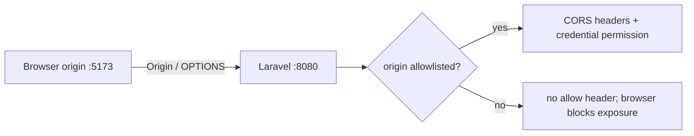

# Chapter 43: CORS and Browser Security Boundaries

Previous: [Chapter 42](./42-cookies-sessions-and-tokens.md)

## Start with the business boundary

An origin is scheme + host + port, so `http://localhost:5173` and `http://localhost:8080` differ. Browsers attach `Origin` and enforce the response; curl displays the response regardless. RelayDesk reflects only configured `FRONTEND_ORIGINS`, adds `Vary: Origin`, permits credentials, and never combines credentialed access with `*`.

## Make the boundary visible


Send an OPTIONS preflight from the allowed origin, then from `http://evil.test`. CORS does not authenticate Alice and does not authorize tenant access; those checks still run for allowed browser requests.

## Evidence checklist

At each boundary record: event/state; method and URL; request headers, cookie, and JSON body; route, request ID, identity, validation and authorization; SQL/row effect; response status, headers and JSON; final React state/render. An explanation without an artifact is still a hypothesis.

## Controlled lab and verification

```sh
curl -i -X OPTIONS -H 'Origin: http://localhost:5173' -H 'Access-Control-Request-Method: POST' http://localhost:8080/api/v1/tickets
```

Predict the observation first, run it, save the status/body and `X-Request-ID`, then inspect the matching log and database row. Reset with `make reset`; never use lab controls outside local/testing.

## References

- [HTTP Semantics (RFC 9110)](https://www.rfc-editor.org/rfc/rfc9110)
- [MDN: HTTP response status codes](https://developer.mozilla.org/en-US/docs/Web/HTTP/Reference/Status)
- [Laravel: HTTP responses](https://laravel.com/docs/12.x/responses)
- [Laravel: authentication](https://laravel.com/docs/12.x/authentication)
- [Laravel: authorization](https://laravel.com/docs/12.x/authorization)
- [MDN: CORS](https://developer.mozilla.org/en-US/docs/Web/HTTP/Guides/CORS)
- [OWASP Session Management Cheat Sheet](https://cheatsheetseries.owasp.org/cheatsheets/Session_Management_Cheat_Sheet.html)

## Exit proof

Explain what crossed every boundary and identify which artifact would distinguish HTTP rejection, application rejection, and no completed request. Continue to the next chapter only when the normal suite remains green.

Part V ends here. Do not begin Part VI yet.
