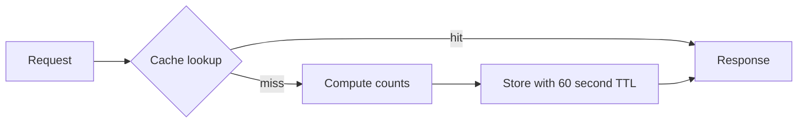

# Chapter 44: Caching and Invalidation

> Part VI — Build Systems That Survive Reality

## The pressure

The dashboard repeatedly counts the same tenant's tickets. The result changes less often than it is read, so it is a justified cache candidate—not because Redis or caching is fashionable. RelayDesk uses Laravel's database cache store to avoid another service: it makes the second copy of state directly inspectable in `cache`. Redis would change storage and operational properties, not the hit/miss/invalidation reasoning.

`DashboardSummary::key` includes the organization and schema version. The cached value is counts, the TTL is 60 seconds, and ticket creation explicitly forgets the key. Both lookup outcome and duration are logged. A TTL bounds staleness; it is not a substitute for invalidating known writes.

## Lab: fast and wrong

1. Run `docker compose exec web php artisan lab:resilience cache`.
2. Observe miss, hit, direct database mutation, stale cached value, and repaired miss.
3. Inspect `SELECT cache.key, cache.expiration FROM cache;` and query `tickets` separately.
4. For the HTTP version, warm `GET /api/v1/dashboard?organization_id=1`, then create with `X-RelayDesk-Lab: stale-cache`. This development-only switch skips invalidation.

Prove three different facts: MySQL owns the new durable ticket state; the API returned an old count; `cache` owns the old copy. Repair with `php artisan cache:clear` for the exercise, then remove the fault and rely on targeted invalidation. Global clearing is a blunt operational action, not the application strategy.

Record **value, boundary, ownership, timing, count**. Here the value is stale because two valid copies existed at different times. Never put secrets in a cache merely because it is fast. Tenant-safe keys and authorization before lookup remain mandatory.

Reference: [Laravel cache documentation](https://laravel.com/docs/12.x/cache).

---

[← Chapter 43](./43-cors-browser-security.md) · [Chapter 45 →](./45-queues-background-jobs.md)
