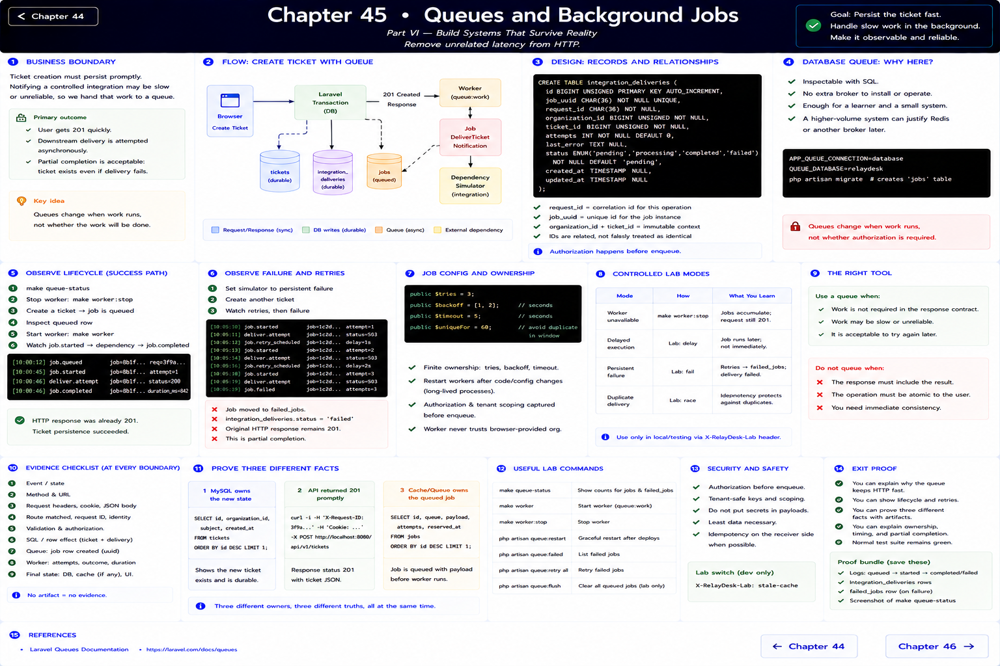
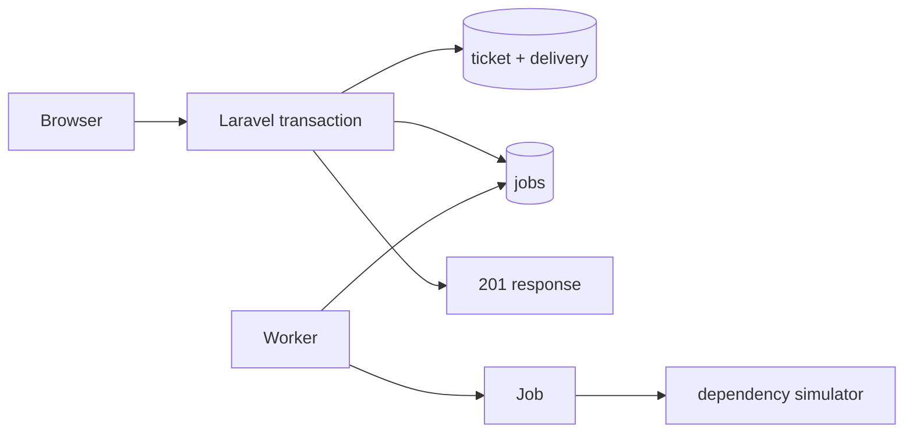

# Chapter 45: Queues and Background Jobs

> Part VI — Build Systems That Survive Reality

## Remove unrelated latency from HTTP

Ticket creation must persist the ticket promptly. Notifying a controlled integration may be slow, so RelayDesk records an `integration_deliveries` row and dispatches `DeliverTicketNotification` after the transaction commits. The database queue is intentional: it is inspectable with SQL and adds no broker for one learner. A higher-volume system could justify Redis or another broker later.

The request ID is a correlation ID for this operation. The job also has its own UUID. `integration_deliveries` relates job, request, tenant, ticket, attempts, and outcome; identifiers are related, not falsely treated as identical.

## Observe lifecycle and failure

Use `make queue-status`, stop the worker, create a ticket, and inspect the queued row. Start it with `make worker`; watch `job.started`, dependency evidence, and `job.completed`. Set the simulator to persistent failure, create another ticket, and watch retries terminate in `failed_jobs` and a `failed` delivery. The original HTTP response remains `201`: ticket persistence succeeded while downstream delivery failed—**partial completion**.

`queue:work --tries=3 --backoff=1,2 --timeout=5` supplies finite ownership. Restart workers after code/config changes because they are long-lived processes. Authorization happens before enqueue; the immutable tenant/ticket identifiers are recorded, and the worker never trusts a browser-provided organization on execution.

Controlled modes also demonstrate worker unavailable (stop worker), delayed execution (`delay`), and duplicate delivery (run the race harness). Do not use a queue for work the response contract must complete synchronously.

Reference: [Laravel queues documentation](https://laravel.com/docs/12.x/queues).

---

[← Chapter 44](./44-caching.md) · [Chapter 46 →](./46-external-apis.md)
