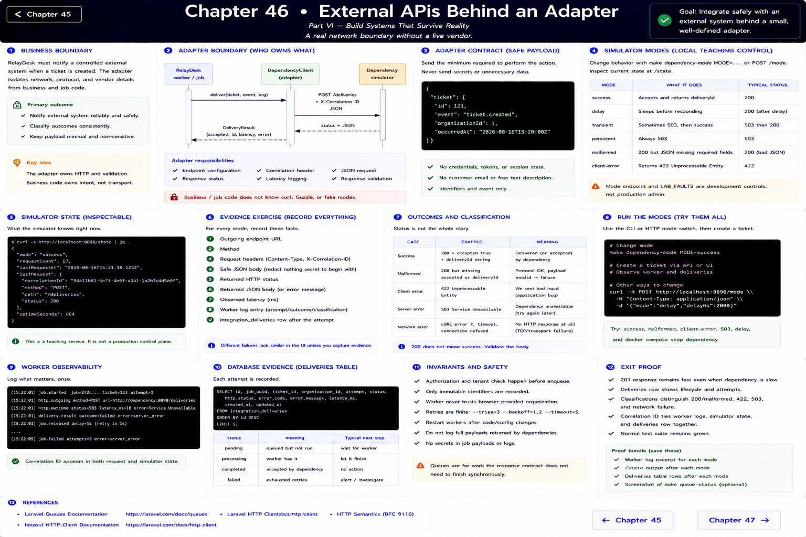
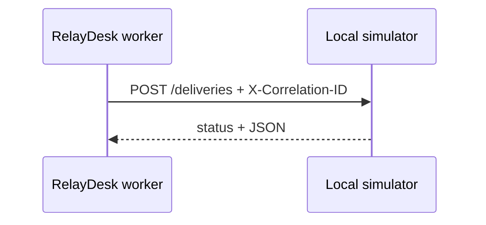

# Chapter 46: External APIs Behind an Adapter

> Part VI — Build Systems That Survive Reality

## A real network boundary without a live vendor

`dependency-simulator/router.php` is a small HTTP service that accepts ticket-created deliveries. `DependencyClient` owns endpoint configuration, correlation header, JSON request, response status, latency logging, and response validation. Business/job code does not know curl options or fake modes.

Change behavior with `make dependency-mode MODE=success`, `delay`, `transient`, `persistent`, `malformed`, or `client-error`; inspect it with `curl http://localhost:8090/state`. The mode endpoint and `LAB_FAULTS` are development teaching controls, not production administration features. The payload contains a ticket identifier and event—not credentials, session state, access tokens, customer email, or unnecessary description text.

## Evidence exercise

For every mode, record outgoing endpoint, method, `Content-Type`, correlation header, safe body, returned status/body, and observed latency. A TCP failure is different from HTTP 503. HTTP 422 is different from malformed success JSON. The adapter requires `accepted === true` and a string `deliveryId`; a 200 response is still untrusted input.

Try success, malformed, 422, 503, delay, and `docker compose stop dependency`. Check the worker log and delivery row after each. A malformed response is categorized without copying the raw response—which could contain sensitive vendor material—into logs.

References: [Laravel HTTP client](https://laravel.com/docs/12.x/http-client), [RFC 9110 HTTP semantics](https://www.rfc-editor.org/rfc/rfc9110).

---

[← Chapter 45](./45-queues-background-jobs.md) · [Chapter 47 →](./47-retries-timeouts-failure.md)
