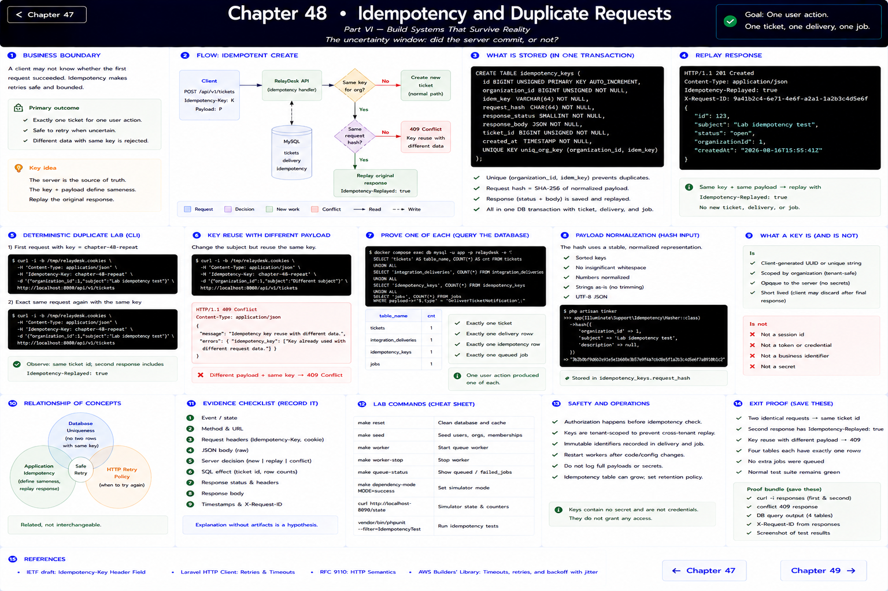
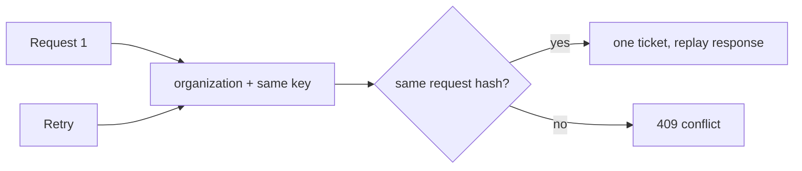

# Chapter 48: Idempotency and Duplicate Requests

> Part VI — Build Systems That Survive Reality

## The uncertainty window

A client can time out after MySQL commits but before it receives `201`. It cannot infer whether retry means “try for the first time” or “repeat completed work.” RelayDesk accepts `Idempotency-Key` on ticket creation. The React client generates a new UUID per user submission and reuses the HTTP operation result only when the server sees the same tenant/key and identical normalized payload.

Inside one transaction RelayDesk creates the ticket, delivery, idempotency record, and queued job. A unique `(organization_id, key)` constraint is the arbiter. The stored request hash detects accidental key reuse with different semantics. A replay returns the original representation plus `Idempotency-Replayed: true`, without another ticket or job. Keys are tenant-scoped and contain no secret.

## Deterministic duplicate lab

Log in, send the exact same POST twice with `Idempotency-Key: chapter-48-repeat`, and compare ticket IDs. Then change the subject while retaining the key and observe 409. Query all four tables and prove one ticket, one delivery, one idempotency record, and one queued job. The tests do these outcome assertions without relying on sleep.

Database uniqueness prevents two records with the same key. Application-level idempotency additionally defines payload equivalence and response replay. HTTP retry policy decides *when* to try again. These are related but not interchangeable. Requests without a key remain supported for the earlier chapter contract and are explicitly not deduplicated.

Reference: [IETF Idempotency-Key draft](https://datatracker.ietf.org/doc/draft-ietf-httpapi-idempotency-key-header/).

---

[← Chapter 47](./47-retries-timeouts-failure.md) · [Chapter 49 →](./49-race-conditions.md)
