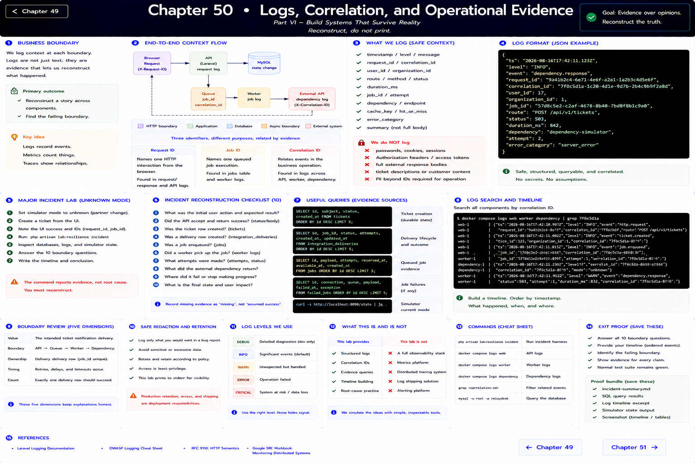
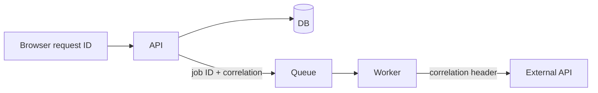

# Chapter 50: Logs, Correlation, and Operational Evidence

> Part VI — Build Systems That Survive Reality

## Reconstruct, do not print

RelayDesk now logs structured context at request, cache, job, and dependency boundaries. The stderr channel emits timestamp/level/message plus safe context: request or correlation ID, user/organization ID, route, status, duration, job ID, dependency, attempt, and error category. It does not log passwords, cookies, sessions, authorization headers, access tokens, complete external bodies, or ticket descriptions.

A request ID names one HTTP interaction. A job ID names queued work. A correlation ID relates events in the business operation. Their relationships are evidence; forcing one ID to mean all three would erase useful distinctions. Logs are event records. Metrics aggregate quantities such as latency and failure count. Traces model causally related spans. RelayDesk simulates the latter two through structured fields and queries rather than requiring an observability platform.

## Major incident lab

Set an unknown simulator mode supplied by a partner, create a ticket, and note only the UI success plus response request/job IDs. Do not assume the failing layer. Run `lab:resilience incident`, inspect `tickets`, `jobs`, `failed_jobs`, `integration_deliveries`, simulator state, and JSON logs. Answer all ten boundary questions from the chapter brief. The command deliberately reports evidence but not root cause.

Use `docker compose logs web worker dependency | grep <correlation>` and build a timeline. Record missing evidence as missing, never as inferred success. Safe redaction is tested by review; production log access and retention remain deployment work outside Part VI.

References: [Laravel logging](https://laravel.com/docs/12.x/logging), [OWASP Logging Cheat Sheet](https://cheatsheetseries.owasp.org/cheatsheets/Logging_Cheat_Sheet.html).

---

[← Chapter 49](./49-race-conditions.md) · [Chapter 51 →](./51-performance-across-stack.md)
