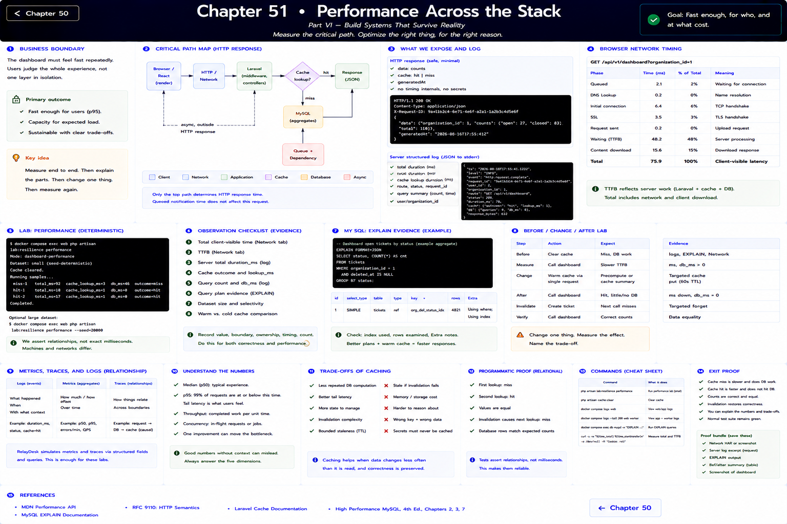
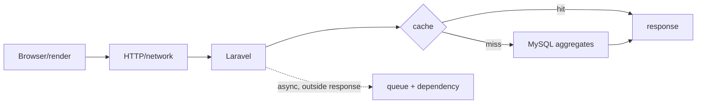

# Chapter 51: Performance Across the Stack

> Part VI — Build Systems That Survive Reality

## Measure the critical path

A slow dashboard could be React rendering, network, Laravel middleware, MySQL aggregation, cache access, or an unrelated dependency. Do not optimize all of them. The dashboard response exposes only data and cache outcome; server structured logs provide total duration and cache lookup duration, browser Network timing provides client-visible latency, and MySQL tools from Chapters 20–21 explain query work. Queued notification time is not on this HTTP critical path.

Run `php artisan lab:resilience performance` after the deterministic small seed, then after the optional 20,000-ticket seed. It records cache-miss and hit samples but intentionally asserts no exact milliseconds. Capture several observations: median is a typical sample, while p95 means 95% completed at or below that threshold and reveals tail experience. Throughput is completed work per interval; improving one request can move the bottleneck elsewhere.

## Before/change/after lab

Clear the cache. Collect browser total, `request.complete`, `cache.lookup`, and relevant query-plan evidence. Identify the dominant cost. Change exactly one thing: warm/cache the tenant summary with targeted invalidation. Repeat under the same dataset and compare. State the trade-off: less repeated database computation, an extra state copy, invalidation complexity, and bounded staleness.

Do not claim universal speed from one laptop or make fragile timing tests. The programmatic proof is relational: first lookup misses, second hits, the value is equal, and invalidation changes ownership. This culmination asks **value, boundary, ownership, timing, count** for both correctness and cost.

References: [MDN Performance API](https://developer.mozilla.org/en-US/docs/Web/API/Performance), [MySQL EXPLAIN](https://dev.mysql.com/doc/refman/8.4/en/explain.html).

---

[← Chapter 50](./50-logging-observability.md)
