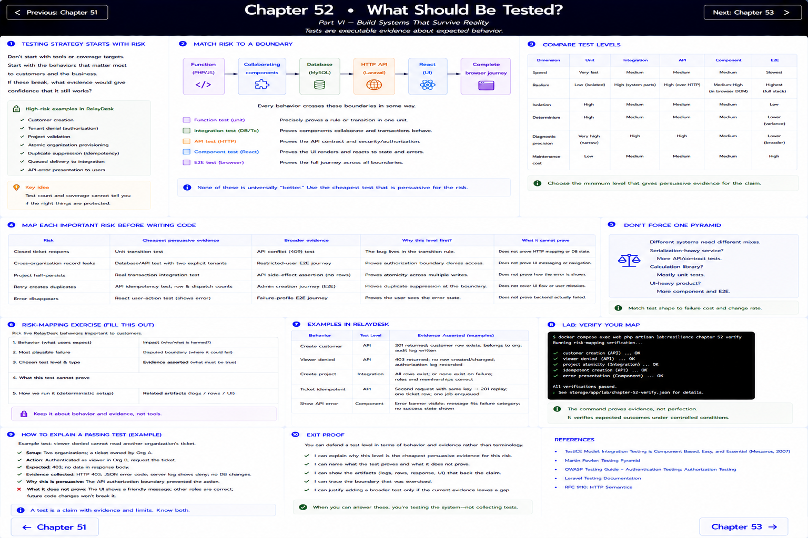
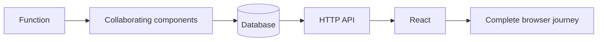

# Chapter 52: What Should Be Tested?

[Previous](51-performance-across-stack.md) · [Next](53-unit-tests.md) · [Testing strategy](../../docs/TESTING_STRATEGY.md)

> Tests are executable evidence about expected behavior.

Start with risk. If customer creation, tenant denial, project validation, atomic provisioning, duplicate suppression, queued delivery, or API-error presentation broke, what evidence would give confidence that it still works? Test count and coverage cannot answer that question.

## Match risk to a boundary

A unit test precisely proves a transition rule. An integration test proves the transaction actually rolls back. An API test proves a viewer gets `403` and no row. A component test proves that an error is visible. An E2E test proves the journey works across all boundaries. None is universally “better.” Compare speed, realism, isolation, determinism, diagnostic precision, and maintenance cost.

Map each important risk before writing code:

| Risk | Cheapest persuasive evidence | Broader evidence |
| --- | --- | --- |
| Closed ticket reopens | Unit transition test | API conflict |
| Cross-organization record leaks | Database/API test with two explicit tenants | Restricted-user E2E |
| Project half-persists | Real transaction integration test | API side-effect assertion |
| Retry creates duplicates | API idempotency test, row and dispatch counts | Admin creation journey |
| Error disappears | React user-action test | Failure-profile journey |

Do not force one testing pyramid onto every system. A serialization-heavy service may need more contract tests; a calculation library needs mostly units. Choose the minimum integration necessary for the claim.

## Risk-mapping exercise

List five RelayDesk behaviors. For each write: impact, plausible failure, disputed boundary, chosen test, evidence asserted, and what it cannot prove. Run `scripts/lab chapter 52 verify`, then explain one passing test without saying “the code works.”

**Exit proof:** you can defend a test level in terms of behavior and evidence rather than terminology.
