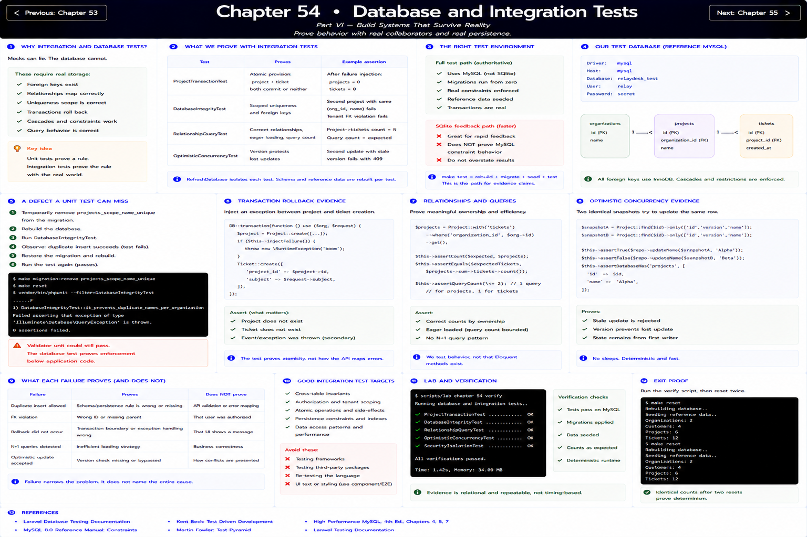

# Chapter 54: Database and Integration Tests

[Previous](53-unit-tests.md) · [Next](55-api-tests.md)

A mocked repository can report “saved.” It cannot prove a foreign key exists, a relationship maps correctly, a uniqueness scope is correct, or a transaction rolls back. Those claims require cooperating code and real persistence.

## Evidence on storage

Run `make test-integration`. `ProjectTransactionTest` proves both records commit or neither does. `DatabaseIntegrityTest` bypasses HTTP validation and proves scoped uniqueness; its composite tenant foreign-key assertion runs on reference MySQL. `RelationshipQueryTest` protects eager loading, and `OptimisticConcurrencyTest` uses two identical snapshots rather than a race based on sleeps.

`RefreshDatabase` isolates each test. Every security test creates an organization and owned customer explicitly. The full `make test` path destroys the Compose volume, migrates from zero, and runs on MySQL; a passing SQLite feedback run must not be overstated as MySQL constraint evidence.

## A defect a unit misses

Temporarily remove `projects_scope_name_unique` from the migration, rebuild the database, and run the integrity test. A project-name validator unit could still pass while a second process or direct SQL insert violates the invariant. Restore the migration and rebuild. The database test proves enforcement below application code.

For rollback evidence, inject the exception between project and ticket creation. Assert both missing, not just the thrown exception. For relationships, assert meaningful ownership and query count rather than Eloquent method existence.

**What does failure prove?** A duplicate-row failure narrows the problem to schema/persistence behavior. It does not prove whether the public API maps the exception appropriately.

**Exit proof:** run `scripts/lab chapter 54 verify`, then `make reset` twice and observe identical seed counts.
