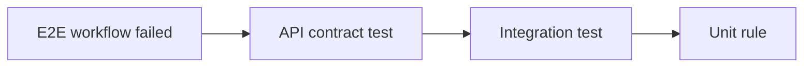

# Chapter 55: API Tests

[Previous](54-database-integration-tests.md) · [Next](56-react-tests.md)

Treat HTTP as a contract. Request through Laravel's application boundary and assert status, stable headers/shape, important values, and side effects.

`PartFiveApiTest` covers unauthenticated `401`, viewer `403`, cross-tenant denial, successful `201`, camel-case JSON, and persistence. `PartSixResilienceTest` covers idempotent replay `201`, `Idempotency-Replayed`, conflict `409`, one ticket, one delivery, and one queued job. Existing CRUD and business-error tests retain validation `422`, not found `404`, and conflict behavior.

```sh
make test-api
```

Do not assert every timestamp or serialize the entire response into a snapshot. Protect what clients rely on: `data.customerId`, the absence of `customer_id`, status, `Location`, request correlation, and business effects.

## Contract regression

Temporarily rename `customerId` in `TicketResource`, run `PartFiveApiTest`, and observe failure before React mysteriously receives `undefined`. Restore the resource and rerun API plus frontend tests. The failure proves the API representation broke; it does not prove persistence broke.

For tenant tests, create two organizations and memberships, then identify ownership in every record. A `403` alone is insufficient for a mutation: also assert the forbidden row was not created or changed.



This is diagnostic narrowing, not a mandatory order for writing tests.

**Exit proof:** `scripts/lab chapter 55 verify` supplies contract evidence without depending on React.
