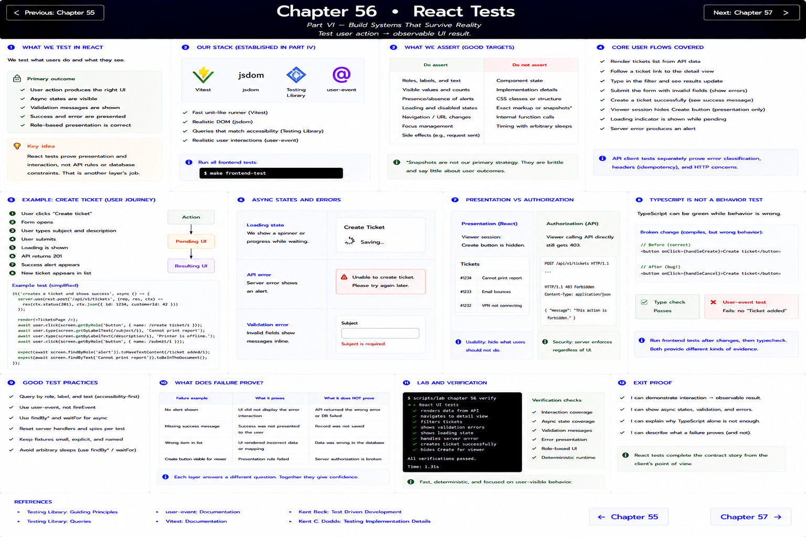

# Chapter 56: React Tests

[Previous](55-api-tests.md) · [Next](57-end-to-end-tests.md)



Test user action → observable UI result. RelayDesk uses Vitest, jsdom, Testing Library, and `user-event` already established in Part IV.

```sh
make frontend-test
```

The suite renders API data, follows a URL to detail, types a filter, submits invalid fields, and creates a ticket. Queries use roles, accessible labels, and visible text—not component state, CSS structure, or snapshot churn. The API client tests separately prove error classification and the idempotency header.

A loading assertion proves pending UI. A rejected fake response should produce an alert. A viewer session should hide the create action while the API independently enforces `403`; hiding a button is usability, not authorization.

## TypeScript is not a behavior test

TypeScript accepts a button wired to the wrong valid callback. Temporarily change the create button to call a harmless handler. Type checking passes, while the user-event test never observes “Ticket added.” Restore the handler, run frontend tests, then typecheck. Similarly, an incorrect conditional can be type-correct and behaviorally wrong.

Avoid arbitrary sleeps: `findByRole`, `findByText`, and `waitFor` wait for observable conditions. Reset fakes per test and keep fixture data small and named. Snapshots are not the primary strategy because they poorly express user outcomes.

Ask what a failure proves. A missing alert proves the rendered interaction did not expose the error; it does not establish whether production Laravel returned the intended error.

**Exit proof:** `scripts/lab chapter 56 verify` demonstrates interaction, async state, validation, and presentation evidence.
