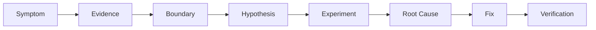

# Chapter 58: The Full-Stack Debugging Method

[Previous](57-end-to-end-tests.md) · [Evidence worksheet](../worksheets/debugging-evidence.md)

Use **Symptom → Evidence → Boundary → Hypothesis → Investigation → Root Cause → Fix → Verification**. Debugging is hypothesis testing, not random modification.



Ask: What exactly is wrong? Where is the last known-correct value and first known-incorrect value? Who owns state? Did the operation occur, at the right time, in the right order, and the correct number of times? Which request/job/idempotency identifier joins the evidence? What observation would disprove the hypothesis?

Review six dimensions: **value, boundary, ownership, timing, ordering, count**. “Clicked twice” is not a root cause if two requests shared an idempotency key and two rows exist; count evidence locates the broken guarantee.

## Major lab: the Monday escalation

A support lead reports three independent symptoms after a release:

- repeated ticket submission creates duplicate tickets and deliveries;
- dashboard counts stay stale after creation;
- the creation response promises background work, but notification remains pending.

Expected final behavior: one key represents one outcome, dashboard reads fresh counts after mutation, and one durable job reaches the controlled dependency. The application, DevTools, curl, SQL, queue status, simulator state, structured logs, request IDs, job IDs, focused tests, and the worksheet are available.

Activate the deterministic development-only profile:

```sh
make reset
make debug-capstone
```

Do not inspect solution notes until you have one evidence record per symptom. Begin with an E2E symptom, then use API requests with a stable request ID and idempotency key, dashboard responses showing cache hit/miss, `make queue-status`, dependency state, and SQL counts. Form one falsifiable hypothesis at a time.

For each defect: reproduce; diagnose; fix; verify the behavior; add or identify the right regression test; rerun the broader relevant suite. A fix changes the system. A regression test preserves the lesson. `app/tests/Feature/CapstoneProfileTest.php` protects normal duplicate and dispatch behavior; cache/API and job tests remain in `PartSixResilienceTest`.

Return to normal with `make reset`. Only afterward compare [separate instructor material](../solutions/58-debug-capstone.md).

## Verification ladder

A green browser journey proves the workflow once. Preserve it with the focused API test, integration invariant, or unit rule that best owns the defect, then run `make test`. Verification must explain what passed and what each test cannot prove.

**Exit proof:** a completed worksheet contains observations, a falsifiable hypothesis, the smallest justified fix, focused regression protection, and broader rerun evidence for every symptom.
