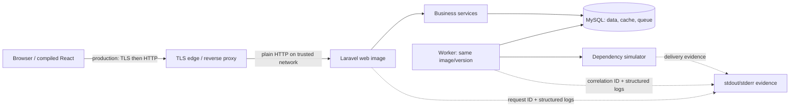

# Chapter 59: From Repository to Production

[Previous](58-full-stack-debugging-method.md) · [Next](60-capstone.md)

> What has to be true for code in this repository to become a system other people can reliably use?

“It works on my machine” proves one execution. Shipping establishes a chain of evidence:

**source → checks → build → versioned image → configuration → migration → processes → traffic → observation → verification → recovery**.

Deployment success is a hypothesis until application behavior provides evidence.

## Inspect the concrete system

RelayDesk remains a modular monolith. `app/Dockerfile` builds React assets, installs optimized Composer dependencies, and puts both into one immutable PHP image. `compose.production.yaml` runs that image twice: `web` serves HTTP and `worker` consumes the database queue. MySQL owns application, cache, and queue persistence. The repository's PHP simulator is the controlled external dependency. This deliberately uses no Redis, Kubernetes, cloud vendor, or live email service.



The learning deployment binds Laravel directly to local port 8080 and therefore uses HTTP. In an internet deployment, a separately operated reverse proxy/load balancer terminates TLS, owns certificate issuance/renewal, and forwards HTTP to `web`; `SESSION_SECURE_COOKIE` must then be true. TLS protects the browser connection; it does not replace authentication or authorization. The built-in PHP server is appropriate for this production-*like* lab, not a recommendation for internet traffic.

## Development is not production elsewhere

| Concern | Development Compose | Production-like Compose |
| --- | --- | --- |
| configuration | safe defaults, `.env`, lab faults | explicit `.env.production`; required values fail interpolation |
| debug/labs | local controls allowed | debug and lab controls off |
| secrets | published teaching credentials | generated key/passwords, uncommitted and externally managed in real hosting |
| frontend | optional Vite hot reload | compiled, content-hashed assets inside image |
| schema/data | startup reset/seed is convenient | explicit migration; never automatic seed/reset |
| lifecycle | manually restarted | restart policy; separate web/worker processes |
| persistence | disposable named volume | named persistent volume plus verified backups |
| logs/version | debug-level console | JSON stderr, info level, immutable `APP_VERSION` |
| recovery | reset fixtures | restore data or deploy known image after an explicit decision |

An image is the filesystem/package produced by a build. A container is one running instance of that image. Its command is the process; its port is a network entry; Compose gives services DNS names on a network; the MySQL volume outlives replaceable containers. Website availability proves only the web process—not the worker, queue progress, dependency, or complete system—is healthy.

## Code, configuration, secrets

**Code is behavior. Configuration is an environment-specific choice. Secrets are sensitive configuration requiring protection.** `.env.production.example` is the inventory. `APP_VERSION`, URLs, timeouts, log level, database name, and queue/cache drivers are configuration. `APP_KEY` and database passwords are secrets. Never put real values in the image, Git, logs, screenshots, audit records, or an issue.

Prepare the learning environment:

```sh
cp .env.production.example .env.production
docker run --rm -v "$PWD/app:/app" -w /app php:8.4-cli php artisan key:generate --show
# replace all CHANGE_ME values; use independent long random database passwords
```

Before build/deploy, `compose.production.yaml` uses `${NAME:?message}` so missing required configuration stops before a misleading partial startup. Run a safe failure:

```sh
cp .env.production .env.production.saved
sed -i.bak '/^APP_KEY=/d' .env.production
make production-build             # boundary: configuration interpolation, not Laravel/MySQL
mv .env.production.saved .env.production
```

Record symptom, exact error, failing boundary, hypothesis, repair, and rerun. A wrong `DB_PASSWORD` instead allows image creation but makes readiness return `503`; liveness can remain `200`. That distinction is evidence.

## Build time, release time, runtime

```sh
make production-build
```

At **build time**, the exact direct npm versions declared by this edition compile TypeScript/React into `public/build`, Composer installs PHP packages and optimizes autoloading, and Docker creates `relaydesk:$APP_VERSION`. The version is baked into the image and exposed by liveness. No database, credentials, migrations, or traffic belong to build time. A generated npm lockfile remains an edition-hardening task; until it is committed, transitive Node resolution is not perfectly reproducible and CI deliberately uses `npm install` rather than pretending otherwise.

At **release time**, an operator supplies configuration and applies migrations once. At **runtime**, web handles requests, worker leases jobs, MySQL retains state/cache/queue, and the dependency accepts outbound calls. Web and worker must run the same artifact version. Inspect rather than infer:

```sh
docker image inspect "relaydesk:$(sed -n 's/^APP_VERSION=//p' .env.production)"
docker compose --env-file .env.production -f compose.production.yaml config
docker compose --env-file .env.production -f compose.production.yaml ps
```

## Migration and deployment order

Schema is shared mutable production state. Prefer backward-compatible expand/deploy/contract changes: add nullable/defaulted structures first, deploy code able to coexist with old/new forms, backfill if needed, and remove old structure only after old code is gone. A destructive migration can make image rollback unsafe.

The learning release is explicit:

```sh
make production-build
make production-deploy
```

`scripts/production` runs `php artisan migrate --force` as a one-off container, then starts web/worker and verifies. It does not hide migration errors with `|| true`, does not seed production, and does not migrate independently in every replica.

### Unapplied-schema rehearsal

Create a throwaway branch/migration adding a field used by code. Build it, start only the old database plus new web **without** the migration command, and request that behavior. Capture the safe API response and matching `persistence.failed` log. Confirm `php artisan migrate:status` shows pending, stop traffic, apply migration, retry, and add a deployment check. Do not perform the exercise against valued data. “Deploy code, then figure out the database” has already admitted incompatible traffic.

## Processes, health, and readiness

`GET /api/health/live` performs no dependency work: a `200` says the Laravel process answers and identifies its version. `GET /api/health/ready` performs cheap DB and database-cache round trips: `200` means it can serve ordinary traffic; `503` says do not route traffic. Neither calls the simulator nor drains a queue; expensive comprehensive diagnosis on every probe would create load and coupled failures.

```sh
curl -i http://localhost:8080/api/health/live
curl -i http://localhost:8080/api/health/ready
docker compose --env-file .env.production -f compose.production.yaml stop db
curl -i http://localhost:8080/api/health/live   # process may answer
curl -i http://localhost:8080/api/health/ready  # dependency evidence changes
docker compose --env-file .env.production -f compose.production.yaml start db
```

Worker availability is separate. Stop `worker`, create a ticket, and inspect `jobs`/`integration_deliveries`: the site and readiness remain available while work accumulates. Restart the worker and prove the durable job completes. A production system would alert on oldest queued-job age and failed-job count, not pretend HTTP liveness proves queue health.

## CI is the eligibility gate

`.github/workflows/ci.yml` turns **commit → automated evidence → build eligibility** into one coherent job: dependency install, PHP database/API tests against MySQL, TypeScript, ESLint, Prettier, React tests, documentation links, production assets, and image build. The small E2E journeys remain a local/pre-delivery gate because CI does not currently assemble the full multi-process stack.

To see rejection without damaging main, create a temporary branch, change an API contract assertion or TypeScript property, commit/push it, inspect the failed step, then discard the branch. Never weaken the assertion merely to make green. Continuous delivery means every passing version is releasable; automatic continuous deployment would additionally promote it without a human decision. This repository implements delivery and a reproducible local deployment, not vendor-specific automatic production promotion.

## Post-deployment verification

`make production-verify` checks liveness/version, readiness, process state, migration status, and queue evidence. Complete the hypothesis test with:

1. log in through the compiled SPA;
2. perform a representative tenant-scoped read;
3. create a ticket with an idempotency key;
4. observe the UI result and database write;
5. observe delivery transition from queued to delivered;
6. correlate request/job/dependency logs without secrets;
7. compare `/api/health/live` version with the intended artifact.

JSON stderr answers whether requests fail and which IDs/version are involved. Queue/delivery tables answer whether workers progress and jobs fail. Readiness answers DB/cache reachability. Simulator state and dependency logs explain slow/failed calls. No hosted monitoring purchase is necessary to learn these questions.

## Back up, restore, prove

Artifacts can be rebuilt; production data may be irreplaceable. A recovery point objective (RPO) is tolerable data loss measured in time; a recovery time objective (RTO) is tolerable restoration time. Those business targets determine backup frequency, retention, location, and rehearsal cadence.

```sh
file=$(make -s backup)
make restore-verify FILE="$file"
```

The dump uses a consistent transaction. Verification restores into an isolated database, asserts tables exist, and removes only that verification database. A command exit zero proves a file was written; only restoration plus representative counts/integrity checks makes it credible. Real operations also encrypt copies, restrict access, keep off-host generations, monitor schedules, and regularly time full recovery.

## Bad release and rollback drill

Tag a working image as version N. On a throwaway branch, introduce an observable health or representative-workflow failure, set N+1, build and deploy. Then:

1. detect it through readiness/workflow, not the deploy command;
2. read `/api/health/live` to identify N+1;
3. correlate logs and isolate the boundary;
4. choose fix-forward for a small safe repair or rollback for rapid risk reduction;
5. restore the N image tag in `.env.production` and `compose up -d --no-build web worker`;
6. repeat every post-deployment verification.

Do not reverse an irreversible migration merely because code rolled back. If N+1 only added a nullable table/column, N can often ignore it. If it renamed/dropped/transformed data, restore/fix-forward or a designed compatibility migration may be safer. Record the decision and data consequence.

## Production incident lab

Start from clean production-like state. Ask a partner/instructor to apply `labs/chapter59-incident.env` values without showing you the file, then deploy. User report: **“The page opens, but a new ticket never reaches the integration.”** Do not assume one defect.

Use the established method:

**Symptom → Evidence → Boundary → Hypothesis → Investigation → Root Cause → Fix → Verification**

Collect liveness/readiness/version, browser Network evidence, representative API response/request ID, process list, queue/delivery rows, worker and dependency logs, and migration status. Repair only after locating the boundary. Verify web behavior, worker completion, dependency receipt, no failed job, and matching version. The instructor notes are separate in `book/solutions/59-production-incident.md`.

## Exit evidence

You are finished only when you can truthfully say: **This version was built, tested, configured, migrated, deployed, started, observed, verified, and can be recovered if something goes wrong.**
