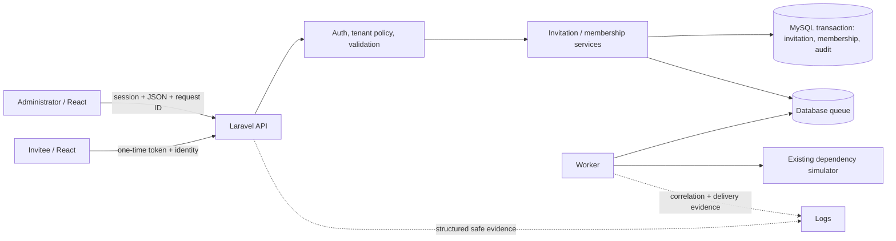

# Chapter 60: Capstone — Engineer a Feature From Requirement to Production

[Previous](59-from-repository-to-production.md) · [Book home](../../README.md) · [Report template](../worksheets/capstone-engineering-report.md) · [Rubric](../worksheets/capstone-rubric.md)

This is not another guided implementation. You own discovery, contract, transaction boundary, evidence, release, and explanation. Do not optimize for matching an imagined class diagram.

## Business brief

> Customers need to invite additional team members into their organization. Organization administrators must be able to assign appropriate access. Invitations should expire and must not be reusable after successful acceptance. The business needs an audit trail showing who invited whom, when the invitation was accepted, and who changed important access permissions.

The language is deliberately incomplete. Turn it into decisions before code.

## 1. Discovery record

Interview the product owner or explicitly mark provisional assumptions. At minimum resolve or escalate:

- Can owners and admins invite, and may each grant every role?
- Can an existing RelayDesk user be invited? What if already a member?
- Is email comparison case-insensitive and normalized?
- What expiry duration and timezone semantics apply?
- Can an invitation be listed, resent, or revoked? By whom?
- What does a second or concurrent acceptance return?
- Must the signed-in identity match the invited email?
- Which audit data is useful and which is unsafe personal/secret data?
- Does delivery failure invalidate the invitation, or remain independently retriable?
- What rate/brute-force controls are proportionate for token inspection/acceptance?
- Who may change a member's role, and can the last owner be demoted?

Copy this table into the report; do not quietly turn guesses into requirements.

| Question | Decision/assumption | Stakeholder | Risk if wrong | How verified |
| --- | --- | --- | --- | --- |
| | | | | |

Write user-visible acceptance outcomes and system invariants. Preserve at least: tenant isolation; no privilege escalation; an unexpired, unrevoked invitation accepts at most once; raw invitation secrets are not retained or logged; membership and acceptance/audit state cannot contradict each other.

## 2. Architecture before implementation

Draw the proposed change. Consider **database, domain service, API, authentication, authorization, frontend, queue, dependency adapter/simulator, tests, observability, and deployment**. A layer may remain unchanged if you explain why. Decide which component owns every rule; “the UI prevents it” is not authorization.

Replace this sketch with your actual design. It is invalid if it shows components you did not build or hides a boundary that owns correctness.

## 3. Persistent design

Design a representation that preserves the invariants. Consider invitation organization, inviter, normalized destination, intended role, **digest rather than raw token**, expiration, accepted/revoked lifecycle, acceptance identity/time, and append-only audit facts. Consider whether delivery state belongs on the invitation or a separate durable record.

Before writing a migration, justify:

- foreign keys and delete behavior;
- unique scope for pending invitations and membership;
- allowed role/state constraints;
- lookup indexes for digest, tenant lists, expiry, and audit history;
- token entropy, one-way digest, and constant-time comparison where applicable;
- the row/constraint locked during acceptance;
- how expiration is evaluated with an injectable/testable clock;
- whether the migration is compatible with the currently deployed image.

Do **not** copy a final schema from this chapter. Review the generated SQL and prove constraints with real MySQL.

## 4. Define API contracts

Define contracts before controllers. Capabilities will probably include create/list/revoke/inspect/accept invitation, modify member permission, and inspect audit history, but exact routes are yours. For each record:

| Method/route | Request | Success/status | Important failures | Auth + tenant authorization |
| --- | --- | --- | --- | --- |
| | | | | |

Be explicit about unauthenticated, forbidden/concealed cross-tenant, invalid/expired/revoked/used token, validation, conflict, and rate-limited responses. Never return a digest. If a raw token must cross the creation response in the learning simulator, expose it once to the authorized delivery boundary and ensure ordinary list/log/audit representations omit it.

## 5. Security review

Threat-model both administrator and invitee paths:

- authenticate the actor and authorize on the server;
- scope every tenant-owned lookup by active organization membership;
- prevent an admin from assigning a role they cannot grant or editing another tenant;
- generate an unguessable token, store only its digest, set expiry, reject revoked/used tokens, and limit brute-force attempts;
- bind acceptance to the intended identity under your documented rule;
- redact URL/query/body token values from structured logs, exceptions, jobs, and audit metadata;
- make permission changes attributable without storing unnecessary personal data.

Search persisted rows and captured logs as part of the proof. Security claims require adversarial requests, not only code inspection.

## 6. Transaction, concurrency, and idempotency

Two acceptance requests arrive nearly simultaneously. Choose the transaction boundary and justify it. A sound design typically combines a transaction, locked/conditional state transition, and unique membership constraint; exact mechanics are yours. Define the losing response and whether a later identical call is a safe stable result or conflict.

Build a **deterministic MySQL test** with a barrier or explicit locks so both contenders reach the dangerous boundary—no sleeps, browser clicking, or probabilistic loop. Assert one accepted transition, one membership, one acceptance audit fact, and no contradictory state. Also decide whether duplicate invitation creation needs an idempotency key or a domain uniqueness policy.

## 7. Background delivery

Use the existing database queue, worker, `DependencyClient` boundary, and simulator rather than a live provider. Invitation creation must commit its core state without waiting for email. Decide what durable state says “created but delivery pending/failed,” how correlation survives dispatch, which failures retry, and how an operator retries safely.

Stop the worker, create an invitation, and prove the request succeeds while work remains visible. Restart it under transient then successful simulator modes. Prove retries do not create another invitation or audit event and terminal failure remains diagnosable. Do not put a raw invitation token into broadly readable logs; document the unavoidable delivery-secret boundary and retention decision.

## 8. Usable frontend workflow

An authorized administrator must view invitations, create one with a role, see status, understand validation/authorization/server errors, and manage included permissions. An invitee must inspect and accept through an appropriate flow. Provide observable loading, empty, success, pending-delivery, expired/revoked/accepted, and error states. Unauthorized actions should not be offered, but the API must still enforce them.

Choose component and state ownership based on behavior. Do not add a state framework or design system merely because this is a capstone. Test through user actions and visible results rather than component internals.

## 9. Auditability and observability

Append meaningful events for invitation creation, revocation, acceptance, and member role change. They must answer **what, when, actor, organization, and affected resource** with safe before/after permission metadata. They must never contain raw tokens.

Make request ID, invitation ID (not token), organization ID, actor ID, delivery/job ID, event name, safe outcome/error category, duration, and application version available at the boundaries that need them. Then write the investigation for:

> “I accepted the invitation, but I still cannot access the organization.”

Begin with user/time/organization and request ID; inspect acceptance response/log, invitation state, membership/status/role, acceptance audit, session/current-organization behavior, authorization denial, job delivery only if relevant, and deployed version/migration. Record facts before hypotheses.

## 10. Risk-based evidence

Choose levels that expose the real risk. At minimum demonstrate:

- permission to create and assign permitted roles;
- organization isolation on every administrative operation;
- expiration, invalid token, revocation, and one-time/replay behavior;
- deterministic concurrent acceptance;
- role assignment and escalation denial;
- atomic, safe audit creation;
- declared HTTP contract including important errors;
- meaningful React loading/success/error behavior;
- delivery pending, retry, and terminal failure evidence;
- one real E2E journey from administrator creation through invitee acceptance and resulting access.

Do not create one test per method. Map each business risk to the cheapest evidence capable of detecting it, then retain higher-level proof for boundary integration. Run the reviewer checks in the [rubric](../worksheets/capstone-rubric.md).

## 11. Engineer the release

The feature is not complete when it compiles. Pass Chapter 59's gate:

1. run backend/unit/database/API tests;
2. run React tests, TypeScript, lint, and formatting;
3. execute the E2E journey;
4. build immutable production assets/image with a new version;
5. rehearse migration ordering and compatibility on a disposable copy;
6. back up and verify restoration;
7. migrate and deploy the learning production environment;
8. verify liveness/readiness and intended version;
9. execute create, list, accept, access, role-change, and audit workflow;
10. inspect correlated logs and background delivery state;
11. document rollback versus fix-forward safety for this schema.

Include exact commands, version, results, request/job IDs, and relevant counts in the report. “Compose said started” is not behavioral evidence.

## 12. Trace the final request path

Trace **administrator clicks Invite → React event/state → HTTP method/body/idempotency/request ID → session authentication → tenant/role authorization → validation → domain operation → transaction/constraints → invitation and audit rows → queue row → response contract → React state → worker lease → dependency request → delivery/audit/log evidence**.

At each arrow identify the representation, owner, identifier, expected evidence, failure symptom, and test. Repeat a shorter trace for acceptance, emphasizing token digest lookup and concurrent transaction outcome. If you cannot point to evidence at a boundary, add it without leaking secrets.

## Submission and evaluation

Submit the completed [engineering report](../worksheets/capstone-engineering-report.md), architecture diagram, contract, migrations, implementation, tests, CI result, artifact version, deployment/verification record, and tradeoffs. Assessment uses the [behavioral rubric](../worksheets/capstone-rubric.md), not exact class names or line count.

An instructor strategy exists separately at `book/solutions/60-capstone-reference.md`; it is deliberately not linked as the default path and supplies no copyable final implementation. The repository does not mandate fixed endpoints or hidden implementation contracts. Your declared contract plus the invariant/adversarial evidence is the evaluation surface.

## The final standard

Can you independently reason across **requirement → architecture → frontend → API → backend → database → security → concurrency → background work → testing → observability → deployment → verification**, then explain the tradeoffs? If so, the primary sixty-chapter curriculum is complete.
