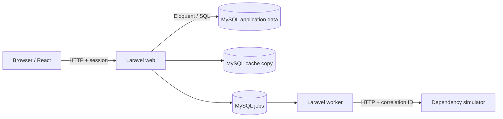

# Final repository audit

Audit date: 2026-08-23. Audited Git baseline: `4018f6d` on branch `work`.

## Executive assessment

RelayDesk has all 60 numbered chapters, one coherent application, executable lab mechanisms, layered tests, a production-like Compose design, and an appropriately independent invitation capstone. The curriculum's conceptual chain is real rather than merely a list of terms: early requests cross observable process and persistence boundaries; Laravel work exposes routing, validation, services, ORM, and SQL; the SPA makes event/state/render and asynchronous state explicit; later work crosses authenticated HTTP, cache, queue, worker, and a controlled external process.

The repository is suitable for editorial and reader review, but it is **not release-ready**. Two material verification issues remain:

1. Neither the npm nor Composer dependency graph is locked. Fresh builds can resolve different transitive versions.
2. This audit environment had no Docker executable. Consequently the clean MySQL suite, live workflows, E2E journeys, production-like deployment, recovery drills, and five major labs could not be re-executed here. Existing code, tests, commands, and CI configuration were inspected, but inspection is not execution evidence.

Those are explicit blockers rather than concealed “completeness.”

## Inventory and method

The audit covered `README.md`, `Makefile`, all root environment/Compose/CI files, every document under `docs`, Chapters 1–60, worksheets, instructor solutions, the lab catalog, every script, PHP application/configuration/migration/test file, React/TypeScript sources and tests, Playwright configuration/journeys, the dependency simulator, and recent Git history. Automated inventory confirms exactly one two-digit chapter for each number 1–60. Chapter sizes and headings were reviewed to identify shallow or overloaded transitions; Chapters 25–34 are intentionally concise executable increments, while 59–60 carry deployment and independent-project depth.

Architecture inspected:

The plan originally proposed Redis for Part VI, but the implemented edition deliberately retains database cache and queue so readers can inspect copies, leases, and attempts using their existing MySQL skills. Current chapters and Compose agree on that implemented decision; the historical plan should not be treated as runtime documentation.

## Curriculum progression

### What works

- **Part I (1–8):** requests, ports, processes, MySQL persistence, and failures are directly observed. Chapter 8 integrates the disposable transparent slice and explicitly hands off to Laravel.
- **Part II (9–17):** route/controller/request/service/model/schema responsibilities remain named and inspectable. Similar symptoms in Chapter 17 force boundary classification.
- **Part III (18–24):** lab commands expose SQL/bindings, query counts, indexes, plans, transactions, optimistic concurrency, and constraints. The concluding incident combines rather than merely repeats them.
- **Part IV (25–34):** plain browser JavaScript and async ordering precede TypeScript and React. Components, state/events, effects, forms, routing, and architecture grow in a coherent order.
- **Part V (35–43):** a stable `/api/v1` contract crosses React → HTTP → Laravel → MySQL and back. Authentication, membership authorization, sessions, and CORS are observable separately.
- **Part VI (44–51):** cache staleness, durable work, simulator failures, bounded retries, idempotency, races, correlation, and relative performance have controlled mechanisms rather than depending on live vendors or hardware-specific timings.
- **Part VII (52–58):** the testing strategy explicitly states what each level proves and does not prove. The debug capstone combines duplicate outcome, stale summary, and missing background progress under one neutral, opt-in profile.
- **Part VIII (59–60):** Chapter 59 distinguishes build/release/runtime, health/readiness, worker status, recovery, and rollback. Chapter 60 begins with business ambiguity and requires assumptions, contracts, security, concurrent acceptance, background delivery, evidence, deployment, and communication without shipping the implementation.

No chapter clearly warrants destructive merging or renumbering. The terse frontend chapters earn their place through one new state/render capability and a controlled lab, although editorial review should ensure their shortness still gives first-time React readers enough explanation.

### Capability gaps found

The major progression does not contain an introduced-and-never-practiced capability; `docs/COMPETENCY_MAP.md` records the evidence. The principal gap is operational evidence, not missing prose: production reproducibility is weakened by absent lockfiles, and this audit could not independently execute Docker-dependent claims.

## Executability

The README exposes a small memorable Make interface for setup, lifecycle, reset, tests, inspection, labs, frontend work, worker/dependency control, production-like delivery, backup, and restore. Scripts use explicit failures and do not silently swallow migration errors. `make reset` destroys only the local named volume, migrates/seeds through container startup, and restores the simulator to success.

Static verification passed for PHP syntax, repository-local Markdown links/path references, and chapter inventory. Dependency installation was attempted from a clean missing-dependency state but both registries returned HTTP 403 through the environment's network policy. Docker-dependent execution could not start because Docker is absent.

### Command verification record

| Purpose | Exact command | Result in this audit |
| --- | --- | --- |
| Inspect Git state/history | `git status --short --branch` and `git log --oneline --decorate --all -20` | passed |
| Complete repository verification wrapper | `make test` | passed available syntax/docs checks; warned and skipped frontend, backend runtime, MySQL, smoke, and E2E evidence because dependencies/Docker were absent |
| Documentation/link/chapter inventory | `./scripts/check-docs` | passed after audit repairs |
| Install frontend dependencies | `cd app && npm install` | blocked: registry returned HTTP 403 |
| Install backend dependencies | `cd app && composer install --no-interaction --prefer-dist` | blocked: Packagist tunnel returned HTTP 403 |
| Start/reset development services | `make reset` | not runnable: Docker executable absent |
| Backend/API/MySQL suites | `make test-backend`, `make test-integration`, `make test-api` | not runnable: Docker executable absent |
| React/static/build checks | `make frontend-check frontend-test frontend-build` | not runnable: dependency install blocked |
| Browser E2E | `make test-e2e` | not runnable: dependencies and stack unavailable |
| Start worker / inspect queue | `make worker` and `make queue-status` | not runnable: Docker executable absent |
| Control simulator | `make dependency-mode MODE=transient` | implementation inspected; live stack unavailable |
| Production build/deploy/verify | `make production-build production-deploy production-verify` | not runnable: Docker executable absent |
| Backup/restore | `make backup` and `make restore-verify FILE=...` | not runnable: production MySQL unavailable |

Do not convert “not runnable” into “passed” based on source inspection. A network- and Docker-enabled release audit must execute every skipped row.

## Debugging progression

The recurring worksheet uses **Symptom → Evidence → Boundary → Hypothesis → Investigation/Experiment → Root Cause → Fix → Verification** and asks what evidence does not prove. Later labs explicitly add value, ownership, timing, ordering, and count. The neutral Chapter 58 profile does not name its diagnoses in reader-facing activation, while instructor explanations remain under `book/solutions`.

The progression is sound: early failures isolate one boundary (connection, runtime, content type, query); Chapter 17 compares similar outward symptoms; Chapters 24, 50, 58, and 59 combine boundaries and require correlation/count evidence. No normal production behavior enables lab faults: production sets `APP_ENV=production` and `LAB_FAULTS=false`, and middleware also checks environment.

## Controlled failure inventory

`labs/catalog.yaml` is the canonical machine-readable inventory. This table summarizes the educationally distinct families; each reset restores normal behavior.

| Chapter(s) | Symptom / boundary | Activation | Required evidence | Repair / regression evidence |
| --- | --- | --- | --- | --- |
| 2–8 | response shape, browser runtime, HTTP media type, connection, DB credentials, query column | request header/query/explicit Compose command | status/body/console/connection/log/SQL | remove one-request control or restore config; smoke verification |
| 9–17 | config, routing, FK/ownership, validation, business rule, error category | explicit artisan/curl inputs | route table, 4xx/5xx body, request ID, row counts | clear cache or correct input/owner; Part II feature tests |
| 18–24 | SQL cost, N+1, missing access path, partial transaction, lost update, integrity incident | `lab:database` subcommands | SQL/bindings, query count, `EXPLAIN`, transaction/row/constraint evidence | restore index/transaction/concurrency control; integration tests |
| 25–34 | event, async ordering, type/prop/effect/form/route defects | explicit source edit | console/typecheck/DOM/behavior/navigation evidence | restore stated contract/guard; typecheck and React tests |
| 36–43 | JSON/method/validation/authentication/authorization/server/CORS boundary | per-request local-only lab header | Network status, headers/body, session, server log | remove header/correct contract; API tests |
| 44 | stale tenant dashboard copy | resilience harness | cache hit/miss, key, DB count | targeted invalidation; cache integration test |
| 45–47, 50 | stopped worker; delayed/transient/persistent/malformed/4xx dependency | worker lifecycle and simulator mode | jobs, attempts, delivery state, correlated logs | restore worker/mode/config; job/API tests |
| 48–49 | duplicate request/key conflict and deterministic interleaving | repeated key / DB harness | ticket/delivery/idempotency/job counts | atomic key outcome/concurrency control; API/integration tests |
| 51 | expensive miss versus hit | deterministic dataset/harness | query counts, plan, cache state, relative decomposition | justified access path/cache; performance harness |
| 58 | duplicate outcome, stale summary, pending work | `make debug-capstone` | request/job IDs and counts across tables/cache/queue | normal profile; `CapstoneProfileTest` plus Part VI tests |
| 59 | healthy web but stalled/misconfigured worker dependency | instructor-applied incident environment | health/version/process/schema/queue/delivery/log evidence | correct process/config and retry; production verification |

The same symptom is reused only when the disputed boundary changes. Controls are explicit and resettable; the Part VII and VIII diagnoses remain in separate instructor material.

## Correlation and traceability

- A simple request receives a validated/generated request ID, returns it as `X-Request-ID`, and logs duration/status; SQL and row evidence identify persistence.
- Authenticated SPA operations carry the Laravel session, resolve active membership, scope tenant rows, and return `requestId` in stable JSON.
- Ticket creation stores an integration delivery with request correlation and a UUID job ID. The queued job logs organization/job/correlation/attempt and forwards correlation to the simulator.
- The capstone requires the same reconstructable invitation path but correctly permits related request/job/audit identifiers rather than prescribing one universal ID.

This is sufficient to reconstruct boundary transitions without logging payloads or tokens.

## Application coherence

One RelayDesk domain evolves rather than being secretly replaced:

1. Chapters 1–8 use a disposable transparent ticket slice to expose the entire path.
2. Chapters 9–24 replace its implementation with Laravel while retaining tickets, customers, organizations, projects, and MySQL.
3. Chapters 25–34 build a typed client first against deterministic adapters, not a second business product.
4. Chapters 35–43 connect that client to a versioned contract and introduce users/memberships only when identity and authority become educational requirements.
5. Chapters 44–59 add operational copies and delivery records only when cache/queue/dependency/release behavior needs visible state.
6. Chapter 60 asks the reader to add invitations/audit behavior independently; the repository intentionally contains no leaked reference implementation.

Terminology is consistently **organization** for the tenant/account boundary, **customer** for the tenant's client, **project** for an engagement, **ticket** for the work item, **membership role** for authority, and **integration delivery** for outbound work. “Work item” is explanatory language, not a competing schema entity.

## Testing

The existing testing strategy maps risk to evidence and identifies exclusions. Critical coverage exists for tenant denial, viewer authorization, API shape, MySQL constraints/transactions, optimistic concurrency, idempotent ticket outcomes, cache invalidation, queued dispatch, dependency response handling, production health, React user behavior, and two high-value E2E journeys.

| Behavior | Unit | Database/integration | API | React | E2E |
| --- | --- | --- | --- | --- | --- |
| Ticket workflow transition | domain decision | persistence/version | status/error contract | visible result | — |
| Tenant isolation / viewer denial | — | ownership constraints | primary proof | permission presentation | viewer journey |
| Ticket creation | — | row/invariants | contract + side effects | submit states | admin journey |
| Idempotent retry | — | unique durable record | replay/conflict/count proof | one key per submission | — |
| Cache invalidation | summary service | tenant key/state | changed dashboard | rendered count | — |
| Delivery job | — | delivery state | dispatch/status | progress/error state | representative journey only |
| Invitation capstone | reader-selected logic | race/invariants | auth/contracts | workflow states | representative invitation journey |

Not every cell is filled: duplication would not add useful confidence. A remaining risk is that ticket idempotency tests prove sequential replay, not two concurrent HTTP requests. Chapter 60 explicitly requires deterministic concurrent acceptance for invitations, but a future maintenance pass should add a real-MySQL simultaneous ticket-key test if the ticket endpoint is treated as production reference behavior.

## Security

Reviewed authentication middleware, session/cookie configuration, CORS allow-list and credentials behavior, membership authorization, direct object access, cross-tenant customer selection, model fillable fields, validation, schema constraints, password hashing in seed/login behavior, idempotency input, lab-mode gating, logs, queue payloads, and capstone token requirements.

Concrete repair: database and unexpected exception logs no longer include raw exception messages. Database driver messages can echo SQL bindings, while unexpected exception messages can contain user/dependency data; logs now retain request identity, exception class, and a safe category. Public API errors were already generic.

The invitation security work is intentionally not implemented for the reader. The capstone contract/rubric requires random tokens stored as one-way digests, expiry/replay controls, intended identity, tenant/role policy, concurrency protection, and searches across storage/log/queue/audit evidence for raw-token leakage.

Educational limitations: this is not a penetration-testing product; the local seed password and non-secure HTTP cookie are local-only; TLS termination, rate limiting, managed secret rotation, WAF/DDoS controls, and formal threat modeling remain deployment responsibilities. Production disables lab controls.

## Data integrity and concurrency

The database owns foreign keys, tenant-consistent composite relationships on MySQL, uniqueness, status/priority/version checks, and durable idempotency uniqueness. Application validation and membership checks provide useful errors without replacing constraints. Project provisioning and optimistic updates make transaction and concurrency boundaries visible.

The invitation capstone correctly demands a single-use acceptance invariant protected in the database transaction and a deterministic two-transaction race. It does not accept frontend disabling as correctness. As noted under Testing, the current ticket-key implementation needs stronger concurrent-request evidence before being presented as a production-grade universal idempotency recipe.

## Reliability

Database cache keys encode organization ownership and have targeted invalidation. Database jobs expose ready/reserved/failed states; workers have bounded attempts, backoff, and timeout. Integration deliveries persist job/correlation/attempt/status evidence. The dependency client distinguishes retryable connection/429/5xx outcomes from permanent 4xx and validates malformed success bodies. The simulator deterministically supports success, 1.5-second delay, two transient 503s then success, persistent 503, malformed body, and 422 client rejection.

No live external service is required. The design correctly treats queued delivery as at-least-once work and uses durable outcome records; it does not claim that dispatch alone proves delivery. Relative query/cache evidence avoids hardware-specific latency promises.

## Major lab audit

Source, activation, safety gate, evidence path, reset, solution separation, and regression mapping were inspected for all five required major labs:

- Part III: Chapter 24 database incident (`lab:database debug`).
- Part V: the versioned boundary failure set in Chapters 36–43.
- Part VI: Chapter 50 correlated worker/dependency incident.
- Part VII: Chapter 58 neutral multi-defect profile.
- Part VIII: Chapter 59 stopped/misconfigured worker incident.

They are plausibly diagnosable and have distinct boundaries, but **none was counted as executed in this audit** because Docker was unavailable. Release verification must reproduce symptom, evidence, repair, and focused/broad regression for each—not merely run its setup command.

## Diagrams, links, navigation, and references

All Markdown internal targets and repository-path references pass `scripts/check-docs`; the checker now also enforces exactly Chapters 1–60 and detects an unclosed Mermaid fence. Chapter navigation reaches 1 through 60, and README entry points reach the curriculum and audit documents. Diagram labels were compared with implemented components and direction; no contradictory Redis component remains in current chapter diagrams.

References are sparse and generally authoritative (IETF/MDN/framework/tool documentation) where protocol or tool behavior needs verification. External-link liveness was not tested because outbound registry/network requests were denied; this remains an editorial link-check item. The lightweight checker verifies fence balance, not Mermaid grammar/rendering, so a renderer must still validate every diagram before layout.

## Production readiness of the learning environment

Chapter 59 includes a versioned multi-stage image, explicit secret/config example, one-off forced migration, separate same-image web/worker processes, cheap live/ready probes, database cache/queue, version identity, post-deploy workflow, consistent dump, isolated restore verification, rollback reasoning, and an incident. It needs no paid infrastructure and clearly labels the PHP teaching server and local HTTP as production-like rather than internet production.

The missing npm and Composer locks contradict a strict reproducible-build claim. The chapter and version baseline now state that limitation precisely. Before release, generate/review locks, use `npm ci` and locked `composer install`, and prove clean builds. Restore verification currently proves tables exist; a release-hardening improvement should also record representative row counts and integrity checks before declaring a backup exercise complete.

## Capstone quality

Chapter 60 is the strongest transfer test in the book. It begins with an ambiguous team-invitation business brief and requires the learner to record assumptions; design boundaries, schema, API and frontend; enforce authentication, role authorization and organization isolation; protect token secrecy, replay and concurrent acceptance; enqueue observable delivery; select evidence across test levels; deploy/migrate/verify; and write an engineering report for technical and business readers.

The rubric rewards requirements, invariants, security, concurrency, reliability, evidence, deployment, observability, communication, and tradeoffs. It rejects line count, novelty, or matching one instructor file layout. The instructor reference is a strategy, not a mechanical solution, and no invitation implementation or hidden exact-class test leaks the answer.

## Repairs made

1. Added this candid final audit, including inventory, command evidence, controlled failures, testing map, security/reliability findings, production/capstone assessment, and blockers.
2. Added the learner competency map so introduced concepts can be checked for later practice and independent demonstration.
3. Added a technology/version baseline that records actual runtime/package sources and the database-cache/queue choice.
4. Linked the audit documents from README.
5. Strengthened documentation checks with exact 1–60 inventory enforcement and Mermaid-fence validation.
6. Removed potentially sensitive raw exception messages from persistence/unexpected structured logs while preserving safe diagnostic categories.
7. Corrected Chapter 59's reproducibility language to identify both missing lockfiles as a release blocker.

## Remaining limitations

### Blocking before release preparation

- Generate and commit reviewed npm and Composer lockfiles under the application directory; update Docker/CI to consume them strictly.
- In a Docker-enabled clean environment, execute setup/reset, MySQL migrations/seeding, all PHP/API/integration tests, frontend static/tests/build, E2E, smoke, worker/cache/simulator workflows, production build/deploy/health, representative full-stack and queued workflows, all five major labs, backup/restore, rollback, chapter/link/navigation checks, and Mermaid rendering.
- Resolve any failures from that execution and append immutable command/output evidence to this report.

### Intentionally outside scope

- Internet-grade TLS edge, managed secrets, HA database, point-in-time recovery, multi-host orchestration, autoscaling, centralized metrics/traces, formal security assessment, billing, attachments, chat, and the deliberately excluded fashionable architectures.
- The capstone invitation implementation itself; shipping it would destroy the independent assessment.
- Hardware-independent exact latency guarantees; labs use plans, counts, state, and relative comparisons.

## Final recommendation

| Stage | Recommendation |
| --- | --- |
| Reader use | **Yes, for review/beta use with the documented Docker baseline and caveats** |
| Editorial review | **Yes** |
| Image generation/layout | **Yes, after Mermaid rendering is checked** |
| Release preparation | **No, blocked by lockfiles and unexecuted clean Docker audit** |

The educational design is coherent and reaches the intended capability, but the final operational proof is incomplete in this environment. Therefore the repository should advance to editorial/reader review, not be labeled a reproducible release.

**READY FOR EDITORIAL/READER REVIEW**
